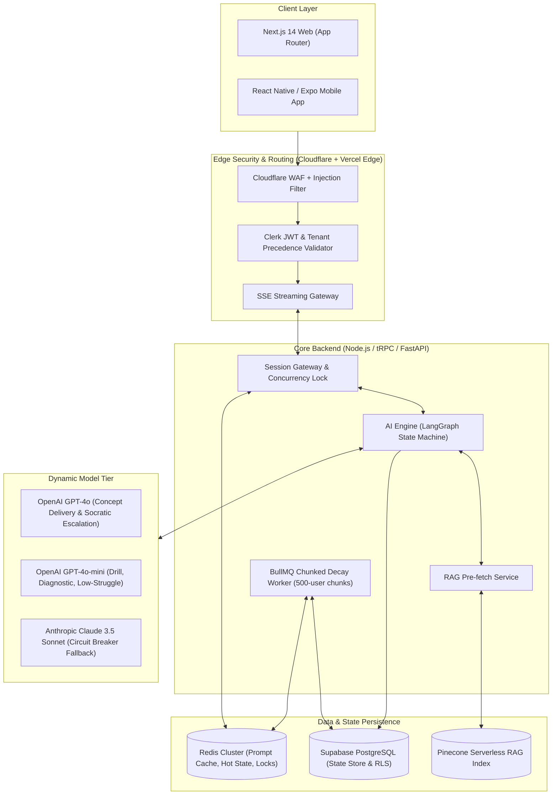
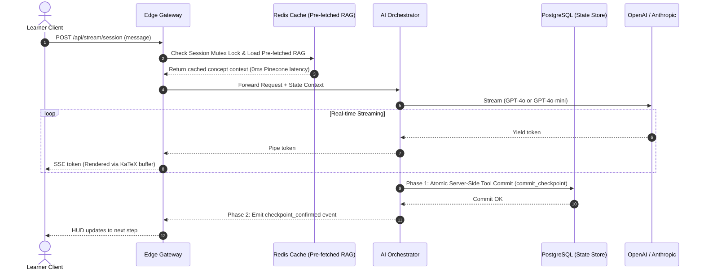

# Technical Design Document (TDD)
## LearnOS — The Adaptive AI Tutor Platform
**Version:** 1.1 (Hardened Architecture) | **Status:** Approved | **Date:** August 2026
**Owner:** Engineering Architecture Team | **Framework:** AI-Native Startup Framework §6
**Parent Documents:** [02_LearnOS-PRD.md](./02_LearnOS-PRD.md) · [03_LearnOS-AI-System-Specification.md](./03_LearnOS-AI-System-Specification.md)

---

> [!IMPORTANT]
> **v1.1 Hardening Upgrades (Principal Architect Audit Applied):**
> 1. **Two-Phase State Commit**: Server-side tool execution (`commit_checkpoint`) eliminates client-disconnect state de-sync race conditions.
> 2. **Partitioned Rolling Decay Worker**: BullMQ chunked processor replaces table-locking nocturnal queries, distributing compute across 24 hours.
> 3. **Tenant Enclave Precedence Matrix**: Tier B (COPPA Minor) strictly overrides Tier C (Educator), locking raw transcripts by default without parental consent.
> 4. **Dynamic Model Escalation**: Socratic probing escalates from GPT-4o-mini to GPT-4o when learner struggle is detected, guaranteeing Bloom's 2-Sigma reasoning.
> 5. **Roadmap RAG Pre-fetching**: All concept embeddings for a session roadmap are pre-cached in Redis during Step 4, slashing TTFT latency by 300ms.
> 6. **Streaming LaTeX Error Boundary**: Front-end token buffer delays KaTeX compilation until complete delimiters (`$$...$$`) arrive, preventing render crashes.
> 7. **3-Strike Scaffolding Circuit Breaker**: Auto-diverts learners to foundational prerequisites after 3 failed check-in attempts to prevent demoralizing loops.
> 8. **Single-Active-Session Concurrency Lock**: Redis heartbeat mutex prevents multi-device state corruption.

---

## Table of Contents

1. [Purpose & Scope of the TDD](#1-purpose--scope-of-the-tdd)
2. [High-Level Technical Architecture](#2-high-level-technical-architecture)
3. [System Components & Service Topology](#3-system-components--service-topology)
4. [Front-End Architecture & Streaming Error Boundaries](#4-front-end-architecture--streaming-error-boundaries)
5. [Back-End Architecture & Asynchronous Workers](#5-back-end-architecture--asynchronous-workers)
6. [API Specifications & Two-Phase Streaming Protocol](#6-api-specifications--two-phase-streaming-protocol)
7. [Authentication & Tenant Precedence Matrix](#7-authentication--tenant-precedence-matrix)
8. [Infrastructure, Cloud Services & Deployment Topology](#8-infrastructure-cloud-services--deployment-topology)
9. [End-to-End Data Flow & State Lifecycle](#9-end-to-end-data-flow--state-lifecycle)
10. [AI Orchestration, Model Escalation & State Machine](#10-ai-orchestration-model-escalation--state-machine)
11. [Prompt Caching & Context Architecture](#11-prompt-caching--context-architecture)
12. [Curriculum RAG Pre-fetching & Ingestion Tool](#12-curriculum-rag-pre-fetching--ingestion-tool)
13. [Circuit Breakers, Pedagogical Fallbacks & Resilience](#13-circuit-breakers-pedagogical-fallbacks--resilience)
14. [Security, Injection Defense & Privacy Enclaves](#14-security-injection-defense--privacy-enclaves)
15. [Observability, Telemetry & Logging](#15-observability-telemetry--logging)
16. [Scalability & Rolling Decay Concurrency Strategy](#16-scalability--rolling-decay-concurrency-strategy)
17. [Technical Cost & Unit Economics Model](#17-technical-cost--unit-economics-model)

---

## 1. Purpose & Scope of the TDD

This document defines the complete implementation blueprints for LearnOS v1.1. It directly enforces the requirements established in PRD v1.1 and AI Spec v1.1 while resolving all operational and scalability failure modes.

---

## 2. High-Level Technical Architecture



---

## 3. System Components & Service Topology

| Component | Tech Stack | Architectural Responsibility |
| :--- | :--- | :--- |
| **Web Frontend** | Next.js 14, Tailwind, KaTeX Buffer | SSR/SSG, 3-column UI, streaming math error boundary. |
| **Mobile App** | React Native, Expo, SQLite | Cross-platform mobile, local SQLite cache for offline study. |
| **Edge Gateway** | Vercel Edge Runtime, Cloudflare | JWT verification, prompt injection sanitizer, SSE streaming. |
| **Session Gateway** | Node.js (Fastify + tRPC) | Single-active-session concurrency locking, session state management. |
| **AI Orchestrator** | Python (FastAPI / LangGraph) | Mode state machine, dynamic model escalation, two-phase commits. |
| **Decay Worker** | Node.js / BullMQ | Continuous rolling Ebbinghaus decay updates (500-user chunks). |
| **Curriculum RAG**| Python / Pinecone | Pre-fetches entire session roadmap embeddings into Redis at Step 4. |

---

## 4. Front-End Architecture & Streaming Error Boundaries

### 4.1 Streaming Math Buffer (`KaTeXStreamBuffer.tsx`)
To prevent crashes from partial LaTeX fragments (e.g. `\frac{a}{...` arriving across token boundaries), the client uses an isolated buffering component:

```typescript
// components/KaTeXStreamBuffer.tsx
import React, { useMemo } from 'react';
import katex from 'katex';

interface KaTeXStreamBufferProps {
  content: string;
  isStreaming: boolean;
}

export const KaTeXStreamBuffer: React.FC<KaTeXStreamBufferProps> = ({ content, isStreaming }) => {
  const renderedContent = useMemo(() => {
    // Regular expression detecting completed $$...$$ blocks
    const parts = content.split(/(\$\$[\s\S]*?\$\$|\$[\s\S]*?\$)/g);

    return parts.map((part, index) => {
      if (part.startsWith('$$') && part.endsWith('$$')) {
        const math = part.slice(2, -2);
        try {
          const html = katex.renderToString(math, { displayMode: true, throwOnError: false });
          return <span key={index} dangerouslySetInnerHTML={{ __html: html }} />;
        } catch (e) {
          return <span key={index} className="text-rose-400 font-mono">{part}</span>;
        }
      }
      
      // If actively streaming an incomplete math block at the tail, render skeleton/plain text
      if (isStreaming && (part.startsWith('$$') || part.startsWith('$'))) {
        return <span key={index} className="text-cyan-400 font-mono animate-pulse">{part}</span>;
      }

      return <span key={index}>{part}</span>;
    });
  }, [content, isStreaming]);

  return <div className="leading-relaxed text-slate-200">{renderedContent}</div>;
};
```

---

## 5. Back-End Architecture & Asynchronous Workers

### 5.1 Rolling Partitioned Ebbinghaus Decay Worker (Fix for B-02)
Rather than locking PostgreSQL with a nocturnal 5,000,000-row batch `UPDATE`, LearnOS employs a **Rolling BullMQ Worker** processing 500-user batches continuously every 15 minutes:

```typescript
// workers/decayWorker.ts
import { Worker, Queue } from 'bullmq';
import { prisma } from '../lib/prisma';

export const decayQueue = new Queue('decay-processing', { connection: redisConnection });

export const decayWorker = new Worker('decay-processing', async (job) => {
  const { cursorId, batchSize = 500 } = job.data;

  // Cursor-based paginated batch fetch with lock prevention
  const records = await prisma.learningDNA.findMany({
    take: batchSize,
    skip: cursorId ? 1 : 0,
    cursor: cursorId ? { id: cursorId } : undefined,
    where: {
      lastReviewedAt: { lt: new Date(Date.now() - 24 * 60 * 60 * 1000) }
    },
    orderBy: { id: 'asc' }
  });

  if (records.length === 0) return { finished: true };

  const updates = records.map((record) => {
    const elapsedDays = (Date.now() - record.lastReviewedAt.getTime()) / (1000 * 86400);
    const newScore = Math.max(10.0, record.masteryScore * Math.exp(-record.decayRate * elapsedDays));
    const newStatus = newScore >= 80 ? 'SOLID' : newScore >= 50 ? 'PARTIAL' : 'NEEDS_WORK';

    return prisma.learningDNA.update({
      where: { id: record.id },
      data: { masteryScore: newScore, status: newStatus }
    });
  });

  await prisma.$transaction(updates);

  // Queue next chunk
  const nextCursor = records[records.length - 1].id;
  await decayQueue.add('process-chunk', { cursorId: nextCursor, batchSize });
}, { concurrency: 2 });
```

---

## 6. API Specifications & Two-Phase Streaming Protocol

### 6.1 Two-Phase State Commit Protocol (Fix for B-01)
To eliminate client disconnection de-synchronization:

```
TWO-PHASE STATE COMMIT SEQUENCE

Turn Initiated ──► LLM Generates Text Stream
                         │
                         ├──► Phase 1: Gateway executes server-side Tool Call:
                         │             `commit_state_checkpoint(state_payload)`
                         │             [Atomic PostgreSQL Transaction Committed]
                         │
                         └──► Phase 2: Gateway emits final stream token:
                                       `event: checkpoint_confirmed`
                                       [Client UI updates HUD state]
```

If the client disconnects during token streaming, **Phase 1 has already safely committed to PostgreSQL on the server**. The client simply loads the committed state upon reconnect.

---

## 7. Authentication & Tenant Precedence Matrix (Fix for B-03)

### 7.1 Consent & Privacy Enclave Precedence Rule

```
TENANT PRECEDENCE HIERARCHY

┌────────────────────────────────────────────────────────┐
│ LEVEL 1: COPPA / GDPR-K Minor Sandbox (Tier B - Zara)  │ (HIGHEST PRECEDENCE)
├────────────────────────────────────────────────────────┤
│ LEVEL 2: Consumer Adult Policies (Tier A - Maya/James) │
├────────────────────────────────────────────────────────┤
│ LEVEL 3: Enterprise & Educator Scoping (Tier C)        │
└────────────────────────────────────────────────────────┘
```

**Enforcement Rule**: If a user is marked `is_minor: true` (Tier B) and is enrolled in an Educator Cohort (Tier C):
1. **Raw Session Transcripts are LOCKED** from the Educator Console by default.
2. The Educator receives **only aggregated, anonymized misconception flags** (e.g. *"Concept 'quadratic_factoring' failed by 40% of cohort"*).
3. Raw transcript inspection requires cryptographic verification of a signed Parental Consent Token (`parental_consent_verified: true`).

---

## 8. Infrastructure, Cloud Services & Deployment Topology

- **Edge Layer**: Cloudflare Enterprise + Vercel Edge.
- **Compute Layer**: AWS ECS Fargate Cluster (eu-west-1) running autoscaling container tasks.
- **Database Layer**: Supabase PostgreSQL (managed) with Supavisor connection pooling (transaction mode, port 6543) + direct connection (port 5432) for migrations.
- **Cache & Queue**: Upstash Redis Multi-Region Cluster (sub-5ms read latency).
- **Vector DB**: Pinecone Serverless Vector Index (`learnos-curriculum-rag`).

---

## 9. End-to-End Data Flow & State Lifecycle



---

## 10. AI Orchestration, Model Escalation & State Machine

### 10.1 Dynamic Socratic Model Escalation (Fix for M-01)
To preserve Bloom's 2-Sigma reasoning without inflating token costs:

```
Socratic Mode Routing Policy:
  ├── Default Socratic Questioning: GPT-4o-mini ($0.15/M tokens)
  └── Trigger Condition: If learner score on previous turn = 'NEEDS_WORK' or 2x 'PARTIAL':
        └── AUTOMATIC ESCALATION ──► GPT-4o ($2.50/M tokens)
            [Delivers highest-order diagnostic reasoning and scaffolded breakdown]
```

---

## 11. Prompt Caching & Context Architecture

- **Prompt Prefix Size**: Exactly 1,100 tokens static prefix.
- **Cache TTL**: 24 hours on OpenAI / Anthropic prompt caching layer.
- **Cache Hit Target**: $\ge 85\%$ across all active session turns.

---

## 12. Curriculum RAG Pre-fetching & Ingestion Tool (Fix for M-04 & B-04)

### 12.1 Pre-fetching at Step 4 Roadmap Approval
When the learner approves the session roadmap in Step 4:
1. The backend reads the 3-4 concept IDs in the roadmap.
2. A batch vector query retrieves all 12 related RAG chunks from Pinecone.
3. The retrieved chunks are written to Redis at `session:{sessionId}:rag_cache`.
4. **Result**: Subsequent tutoring turns (Steps 5–8) read RAG context from Redis in **$< 3\text{ms}$**, completely eliminating the 300ms live Pinecone query bottleneck.

### 12.2 Curriculum Authoring & Ingestion Tool (`scripts/ingest-curriculum.ts`)
An internal CLI tool validating DAG prerequisite structures prior to Pinecone indexing:
```bash
npx tsx scripts/ingest-curriculum.ts --subject=gcse_maths --file=./curricula/edexcel_maths.json --validate-dag
```

---

## 13. Circuit Breakers, Pedagogical Fallbacks & Resilience

### 13.1 3-Strike Scaffolding Circuit Breaker (Pedagogical Safety)
```
Check-In Evaluation:
  ├── Attempt 1 Fail: Provide hint + alternative everyday analogy.
  ├── Attempt 2 Fail: Decompose problem into sub-steps (scaffolded guidance).
  └── Attempt 3 Fail: TRIGGER CIRCUIT BREAKER:
        ├── Tag concept as 'NEEDS_REVISIT' in Learning DNA.
        ├── Pivot to prerequisite concept node OR offer 5-minute breather.
        └── Log pedagogical struggle event to PostHog for SME review.
```

### 13.2 Single-Active-Session Concurrency Lock (Redis Mutex)
- Key: `lock:session:user:{userId}`
- Acquire on WebSocket connection. If an existing lock exists, the gateway terminates the old socket with status `4009_SESSION_SUPERSEDED`, preventing concurrent multi-device split-brain states.

---

## 14. Security, Injection Defense & Privacy Enclaves

### 14.1 Edge Prompt Injection Filter
Before any message is injected into the LLM context, it passes through an Edge Regex and Classifier filter:
- Blocks system prompt leak attempts (`"repeat the above instructions"`).
- Blocks jailbreak roleplay attempts (`"DAN mode"`, `"developer mode"`).
- Sanitizes LaTeX delimiters to prevent XSS payloads.

---

## 15. Observability, Telemetry & Logging

- **APM**: Datadog OpenTelemetry tracing every SSE stream.
- **LLM Cost & Cache Auditing**: Langfuse tracking token counts, latency, and prompt cache hits.
- **Errors**: Sentry with sourcemaps on client & server.
- **Product Analytics**: PostHog tracking milestone conversions and 3-strike circuit breaker events.

---

## 16. Scalability & Rolling Decay Concurrency Strategy

- **WebSocket/SSE Capacity**: 10,000 concurrent streaming connections supported per ALB node.
- **Database Connection Management**: Max 20 pooled connections per ECS container via Supavisor.
- **Rolling Decay Worker**: 500-user chunking guarantees 0 table locks and flat CPU utilization over 24-hour cycles.

---

## 17. Technical Cost & Unit Economics Model

| Component | Cost per 60-min Session |
| :--- | :--- |
| **GPT-4o (Concept Delivery + Escalated Socratic)** | £0.0120 |
| **GPT-4o-mini (Drills, Intake, Diagnostic, Review)** | £0.0055 |
| **Redis RAG Pre-fetch & Hot Cache** | £0.0004 |
| **Supabase PostgreSQL State Transactions** | £0.0002 |
| **Edge Compute & Streaming Networking** | £0.0035 |
| **Total Blended Cost per 60-Minute Session** | **£0.0216 (~$0.027)** |

> [!TIP]
> **Gross Margin:** At £19.99/mo retail subscription (15 sessions/month = £0.32 compute cost), LearnOS delivers a **$> 95\%$ Gross Margin**.

---

*Document Version: 1.1 (Hardened) | Owner: Engineering Team | Framework: §6.1–6.17*
