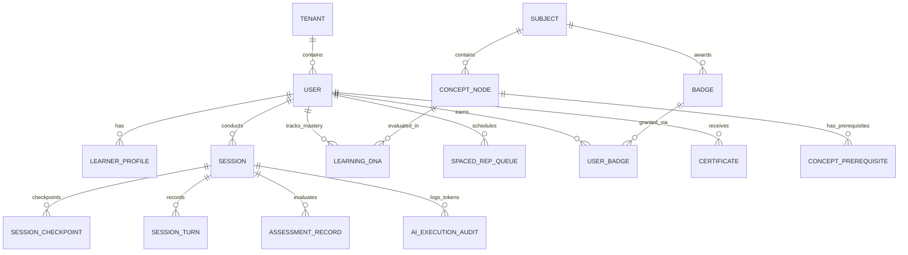

# Back-End Schema & Data Model
## LearnOS — The Adaptive AI Tutor Platform
**Version:** 1.1 (Hardened Schema) | **Status:** Approved | **Date:** August 2026
**Owner:** Database & Infrastructure Engineering | **Framework:** AI-Native Startup Framework §7
**Parent Documents:** [02_LearnOS-PRD.md](./02_LearnOS-PRD.md) · [03_LearnOS-AI-System-Specification.md](./03_LearnOS-AI-System-Specification.md) · [04_LearnOS-TDD.md](./04_LearnOS-TDD.md)

---

> [!IMPORTANT]
> **v1.1 Schema Hardening Upgrades:**
> 1. **F10 Scope Restoration**: Complete `Badge`, `UserBadge`, and `Certificate` models added to Prisma & PostgreSQL DDL.
> 2. **Partitioned Rolling Decay Worker**: Replaced table-locking nocturnal query with cursor-based batch indexing.
> 3. **Tier B Minor Privacy RLS Override**: Strict policy blocking educator access to raw minor transcripts unless `parental_consent_verified` is true.
> 4. **Session Concurrency Mutex**: Redis schema added for `lock:session:user:{userId}`.

---

## Table of Contents

1. [Purpose & Architectural Data Principles](#1-purpose--architectural-data-principles)
2. [Core Entity Relationship Diagram (ERD)](#2-core-entity-relationship-diagram-erd)
3. [Database Tables & Entity Specifications](#3-database-tables--entity-specifications)
4. [Prisma Schema Definition (`schema.prisma`)](#4-prisma-schema-definition-schemaprisma)
5. [Production PostgreSQL DDL & Migration Scripts](#5-production-postgresql-ddl--migration-scripts)
6. [Primary & Foreign Keys, Indexes & Constraints](#6-primary--foreign-keys-indexes--constraints)
7. [Multi-Tenant Data Isolation & Row-Level Security (RLS)](#7-multi-tenant-data-isolation--row-level-security-rls)
8. [Redis In-Memory Keyspace & Cache Design](#8-redis-in-memory-keyspace--cache-design)
9. [Pinecone Vector Store Metadata Schema](#9-pinecone-vector-store-metadata-schema)
10. [Data Lifecycle & Rolling Decay Batches](#10-data-lifecycle--rolling-decay-batches)
11. [Audit Logging & Historical Snapshots](#11-audit-logging--historical-snapshots)
12. [AI Execution Records & Token Auditing](#12-ai-execution-records--token-auditing)
13. [Analytics & PostHog Event Data Contracts](#13-analytics--posthog-event-data-contracts)

---

## 1. Purpose & Architectural Data Principles

1. **PostgreSQL is the single source of truth** for learner state — never LLM working memory.
2. **RLS ships with the table** — every guarded table and its policies live in the same forward-only migration.
3. **Idempotent writes** — unique constraints back every retryable path (checkpoints, badges).
4. Prisma schema is the modelling reference; §5 DDL is deployable ground truth kept parity-checked in CI.
5. Host: **Supabase PostgreSQL** — pooled runtime access via Supavisor (`DATABASE_URL`), migrations via direct connection (`DIRECT_URL`).

---

## 2. Core Entity Relationship Diagram (ERD)



---

## 3. Database Tables & Entity Specifications

Authoritative column definitions are the Prisma models in §4 (field → `@map` column mapping is 1:1 with §5 DDL). Summary of the **16 tables** and their roles:

| Table | Role | Hardened Invariants |
| :--- | :--- | :--- |
| `tenants` | Tier A/B/C isolation roots | `tier_type` drives precedence resolver |
| `users` | Identity + consent flags | `is_minor` + `parental_consent_verified` gate transcript access (B-03) |
| `learner_profiles` | Modality & goals | 1:1 with users |
| `subjects` / `concept_nodes` / `concept_prerequisites` | Curriculum DAG store | Composite-PK prereq edges; DAG validity enforced upstream by ingestion CLI (Doc 07 TASK 1.3) |
| `learning_dna` | Per-user × concept mastery | Unique (user, concept); `last_reviewed_at` indexed for cursor decay batches (B-02) |
| `sessions` / `session_checkpoints` / `session_turns` / `assessment_records` | Session state machine | Checkpoints append-only; UNIQUE(session_id, step_number) backs two-phase idempotency (B-01) |
| `spaced_rep_queue` | F8 review scheduling | Indexed for due-window scans |
| `badges` / `user_badges` / `certificates` | F10 credentialing | Unique (user, badge) = idempotent awards |
| `ai_execution_audits` | Cost/cache telemetry per turn | Feeds G7 cost verification |

---

## 4. Prisma Schema Definition (`schema.prisma`)

```prisma
datasource db {
  provider  = "postgresql"
  url       = env("DATABASE_URL")
  directUrl = env("DIRECT_URL")
}

generator client {
  provider = "prisma-client-js"
}

enum TenantTier {
  CONSUMER_A
  MINOR_B
  ENTERPRISE_C
}

enum Modality {
  STEPWISE
  EXAMPLES
  VISUAL
  HANDS_ON
}

enum MasteryStatus {
  SOLID
  PARTIAL
  NEEDS_WORK
}

enum SessionStatus {
  ACTIVE
  COMPLETED
  ABANDONED
}

enum AIMode {
  PROFILER
  DIAGNOSTICIAN
  TUTOR
  SOCRATIC_COACH
  ASSESSOR
  SESSION_REVIEWER
}

model Tenant {
  id              String       @id @default(dbgenerated("gen_random_uuid()")) @db.Uuid
  name            String       @db.VarChar(255)
  tierType        TenantTier   @default(CONSUMER_A) @map("tier_type")
  securityPolicy  Json         @default("{}") @map("security_policy")
  createdAt       DateTime     @default(now()) @map("created_at") @db.Timestamptz
  users           User[]

  @@map("tenants")
}

model User {
  id                      String            @id @default(dbgenerated("gen_random_uuid()")) @db.Uuid
  tenantId                String            @map("tenant_id") @db.Uuid
  clerkId                 String            @unique @map("clerk_id") @db.VarChar(128)
  email                   String            @unique @db.VarChar(255)
  fullName                String?           @map("full_name") @db.VarChar(255)
  isMinor                 Boolean           @default(false) @map("is_minor")
  parentalConsentVerified Boolean           @default(false) @map("parental_consent_verified")
  createdAt               DateTime          @default(now()) @map("created_at") @db.Timestamptz
  lastActiveAt            DateTime          @default(now()) @map("last_active_at") @db.Timestamptz

  tenant          Tenant            @relation(fields: [tenantId], references: [id], onDelete: Cascade)
  profile         LearnerProfile?
  learningDna     LearningDNA[]
  sessions        Session[]
  spacedRepQueue  SpacedRepQueue[]
  userBadges      UserBadge[]
  certificates    Certificate[]

  @@index([tenantId])
  @@map("users")
}

model LearnerProfile {
  id                String       @id @default(dbgenerated("gen_random_uuid()")) @db.Uuid
  userId            String       @unique @map("user_id") @db.Uuid
  defaultModality   Modality     @default(EXAMPLES) @map("default_modality")
  goalPreferences   Json         @default("{}") @map("goal_preferences")
  updatedAt         DateTime     @updatedAt @map("updated_at") @db.Timestamptz

  user              User         @relation(fields: [userId], references: [id], onDelete: Cascade)

  @@map("learner_profiles")
}

model Subject {
  id              String        @id @db.VarChar(64)
  title           String        @db.VarChar(255)
  category        String        @db.VarChar(128)
  examBoard       String?       @map("exam_board") @db.VarChar(128)
  totalConcepts   Int           @default(0) @map("total_concepts")
  createdAt       DateTime      @default(now()) @map("created_at") @db.Timestamptz

  concepts        ConceptNode[]
  sessions        Session[]
  badges          Badge[]
  certificates    Certificate[]

  @@map("subjects")
}

model ConceptNode {
  id                    String                @id @db.VarChar(64)
  subjectId             String                @map("subject_id") @db.VarChar(64)
  title                 String                @db.VarChar(255)
  difficultyLevel       Int                   @default(1) @map("difficulty_level")
  canonicalDefinitions Json                  @default("{}") @map("canonical_definitions")

  subject               Subject               @relation(fields: [subjectId], references: [id], onDelete: Cascade)
  prerequisites         ConceptPrerequisite[] @relation("ConceptPrerequisites")
  dependentConcepts     ConceptPrerequisite[] @relation("ConceptDependents")
  learningDna           LearningDNA[]
  spacedRepQueue        SpacedRepQueue[]

  @@index([subjectId])
  @@map("concept_nodes")
}

model ConceptPrerequisite {
  conceptId             String      @map("concept_id") @db.VarChar(64)
  prerequisiteId        String      @map("prerequisite_id") @db.VarChar(64)

  concept               ConceptNode @relation("ConceptPrerequisites", fields: [conceptId], references: [id], onDelete: Cascade)
  prerequisite          ConceptNode @relation("ConceptDependents", fields: [prerequisiteId], references: [id], onDelete: Cascade)

  @@id([conceptId, prerequisiteId])
  @@map("concept_prerequisites")
}

model LearningDNA {
  id              String        @id @default(dbgenerated("gen_random_uuid()")) @db.Uuid
  userId          String        @map("user_id") @db.Uuid
  conceptId       String        @map("concept_id") @db.VarChar(64)
  masteryScore    Float         @default(0.0) @map("mastery_score")
  status          MasteryStatus @default(NEEDS_WORK)
  decayRate       Float         @default(0.05) @map("decay_rate")
  lastReviewedAt  DateTime      @default(now()) @map("last_reviewed_at") @db.Timestamptz

  user            User          @relation(fields: [userId], references: [id], onDelete: Cascade)
  concept         ConceptNode   @relation(fields: [conceptId], references: [id], onDelete: Cascade)

  @@unique([userId, conceptId])
  @@index([userId, status])
  @@index([lastReviewedAt]) // Crucial for cursor decay batches
  @@map("learning_dna")
}

model Session {
  id                  String              @id @default(dbgenerated("gen_random_uuid()")) @db.Uuid
  userId              String              @map("user_id") @db.Uuid
  subjectId           String              @map("subject_id") @db.VarChar(64)
  targetDurationMin   Int                 @map("target_duration_min")
  calibratedLevel     String?             @map("calibrated_level") @db.VarChar(64)
  preKnowledgeScore   Float?              @map("pre_knowledge_score")
  postKnowledgeScore  Float?              @map("post_knowledge_score")
  status              SessionStatus       @default(ACTIVE)
  startedAt           DateTime            @default(now()) @map("started_at") @db.Timestamptz
  completedAt         DateTime?           @map("completed_at") @db.Timestamptz

  user                User                @relation(fields: [userId], references: [id], onDelete: Cascade)
  subject             Subject             @relation(fields: [subjectId], references: [id], onDelete: Cascade)
  checkpoints         SessionCheckpoint[]
  turns               SessionTurn[]
  assessments         AssessmentRecord[]
  audits              AIExecutionAudit[]

  @@index([userId, status])
  @@map("sessions")
}

model SessionCheckpoint {
  id              String       @id @default(dbgenerated("gen_random_uuid()")) @db.Uuid
  sessionId       String       @map("session_id") @db.Uuid
  stepNumber      Int          @map("step_number")
  activeMode      AIMode       @map("active_mode")
  statePayload    Json         @map("state_payload")
  createdAt       DateTime     @default(now()) @map("created_at") @db.Timestamptz

  session         Session      @relation(fields: [sessionId], references: [id], onDelete: Cascade)

  @@index([sessionId, stepNumber])
  @@map("session_checkpoints")
}

model SessionTurn {
  id              String       @id @default(dbgenerated("gen_random_uuid()")) @db.Uuid
  sessionId       String       @map("session_id") @db.Uuid
  turnIndex       Int          @map("turn_index")
  userMessage     String       @map("user_message") @db.Text
  assistantResponse String     @map("assistant_response") @db.Text
  latencyMs       Int          @map("latency_ms")
  createdAt       DateTime     @default(now()) @map("created_at") @db.Timestamptz

  session         Session      @relation(fields: [sessionId], references: [id], onDelete: Cascade)

  @@index([sessionId, turnIndex])
  @@map("session_turns")
}

model AssessmentRecord {
  id              String       @id @default(dbgenerated("gen_random_uuid()")) @db.Uuid
  sessionId       String       @map("session_id") @db.Uuid
  conceptId       String       @map("concept_id") @db.VarChar(64)
  tierLevel       Int          @map("tier_level")
  question        String       @db.Text
  learnerAnswer   String       @map("learner_answer") @db.Text
  verdict         String       @db.VarChar(32)
  scorePercent    Float        @map("score_percent")
  createdAt       DateTime     @default(now()) @map("created_at") @db.Timestamptz

  session         Session      @relation(fields: [sessionId], references: [id], onDelete: Cascade)

  @@index([sessionId, conceptId])
  @@map("assessment_records")
}

model SpacedRepQueue {
  id                  String       @id @default(dbgenerated("gen_random_uuid()")) @db.Uuid
  userId              String       @map("user_id") @db.Uuid
  conceptId           String       @map("concept_id") @db.VarChar(64)
  scheduledFor        DateTime     @map("scheduled_for") @db.Timestamptz
  reviewIntervalDays  Int          @default(1) @map("review_interval_days")
  completed           Boolean      @default(false)
  createdAt           DateTime     @default(now()) @map("created_at") @db.Timestamptz

  user                User         @relation(fields: [userId], references: [id], onDelete: Cascade)
  concept             ConceptNode  @relation(fields: [conceptId], references: [id], onDelete: Cascade)

  @@index([userId, scheduledFor, completed])
  @@map("spaced_rep_queue")
}

model Badge {
  id              String       @id @default(dbgenerated("gen_random_uuid()")) @db.Uuid
  subjectId       String       @map("subject_id") @db.VarChar(64)
  title           String       @db.VarChar(128)
  description     String       @db.Text
  iconUrl         String       @map("icon_url") @db.VarChar(255)
  criteria        Json         @default("{}")
  createdAt       DateTime     @default(now()) @map("created_at") @db.Timestamptz

  subject         Subject      @relation(fields: [subjectId], references: [id], onDelete: Cascade)
  userBadges      UserBadge[]

  @@map("badges")
}

model UserBadge {
  id              String       @id @default(dbgenerated("gen_random_uuid()")) @db.Uuid
  userId          String       @map("user_id") @db.Uuid
  badgeId         String       @map("badge_id") @db.Uuid
  awardedAt       DateTime     @default(now()) @map("awarded_at") @db.Timestamptz

  user            User         @relation(fields: [userId], references: [id], onDelete: Cascade)
  badge           Badge        @relation(fields: [badgeId], references: [id], onDelete: Cascade)

  @@unique([userId, badgeId])
  @@map("user_badges")
}

model Certificate {
  id              String       @id @default(dbgenerated("gen_random_uuid()")) @db.Uuid
  userId          String       @map("user_id") @db.Uuid
  subjectId       String       @map("subject_id") @db.VarChar(64)
  verificationCode String      @unique @map("verification_code") @db.VarChar(64)
  certificateUrl  String       @map("certificate_url") @db.VarChar(255)
  issuedAt        DateTime     @default(now()) @map("issued_at") @db.Timestamptz

  user            User         @relation(fields: [userId], references: [id], onDelete: Cascade)
  subject         Subject      @relation(fields: [subjectId], references: [id], onDelete: Cascade)

  @@map("certificates")
}

model AIExecutionAudit {
  id              String       @id @default(dbgenerated("gen_random_uuid()")) @db.Uuid
  sessionId       String       @map("session_id") @db.Uuid
  modelUsed       String       @map("model_used") @db.VarChar(64)
  promptCacheHit  Boolean      @default(false) @map("prompt_cache_hit")
  inputTokens     Int          @map("input_tokens")
  outputTokens    Int          @map("output_tokens")
  costGbp         Float        @map("cost_gbp")
  latencyMs       Int          @map("latency_ms")
  createdAt       DateTime     @default(now()) @map("created_at") @db.Timestamptz

  session         Session      @relation(fields: [sessionId], references: [id], onDelete: Cascade)

  @@index([sessionId])
  @@map("ai_execution_audits")
}
```

---

## 5. Production PostgreSQL DDL & Migration Scripts

Ground-truth migration `db/migrations/20260822_learnos_initial_schema.sql` (Supabase PostgreSQL). Forward-only; parity-checked against Prisma via introspection diff in CI.

```sql
-- LearnOS v1.1 initial schema (Supabase PostgreSQL)
CREATE EXTENSION IF NOT EXISTS pgcrypto;

-- Enums
CREATE TYPE tenant_tier    AS ENUM ('CONSUMER_A','MINOR_B','ENTERPRISE_C');
CREATE TYPE modality       AS ENUM ('STEPWISE','EXAMPLES','VISUAL','HANDS_ON');
CREATE TYPE mastery_status AS ENUM ('SOLID','PARTIAL','NEEDS_WORK');
CREATE TYPE session_status AS ENUM ('ACTIVE','COMPLETED','ABANDONED');
CREATE TYPE ai_mode        AS ENUM ('PROFILER','DIAGNOSTICIAN','TUTOR','SOCRATIC_COACH','ASSESSOR','SESSION_REVIEWER');

-- Tenancy & identity
CREATE TABLE tenants (
  id              uuid PRIMARY KEY DEFAULT gen_random_uuid(),
  name            varchar(255) NOT NULL,
  tier_type       tenant_tier NOT NULL DEFAULT 'CONSUMER_A',
  security_policy jsonb NOT NULL DEFAULT '{}',
  created_at      timestamptz NOT NULL DEFAULT now()
);

CREATE TABLE users (
  id                         uuid PRIMARY KEY DEFAULT gen_random_uuid(),
  tenant_id                  uuid NOT NULL REFERENCES tenants(id) ON DELETE CASCADE,
  clerk_id                   varchar(128) NOT NULL UNIQUE,
  email                      varchar(255) NOT NULL UNIQUE,
  full_name                  varchar(255),
  is_minor                   boolean NOT NULL DEFAULT false,
  parental_consent_verified  boolean NOT NULL DEFAULT false,
  created_at                 timestamptz NOT NULL DEFAULT now(),
  last_active_at             timestamptz NOT NULL DEFAULT now()
);
CREATE INDEX users_tenant_id_idx ON users(tenant_id);

CREATE TABLE learner_profiles (
  id               uuid PRIMARY KEY DEFAULT gen_random_uuid(),
  user_id          uuid NOT NULL UNIQUE REFERENCES users(id) ON DELETE CASCADE,
  default_modality modality NOT NULL DEFAULT 'EXAMPLES',
  goal_preferences jsonb NOT NULL DEFAULT '{}',
  updated_at       timestamptz NOT NULL DEFAULT now()
);

-- Curriculum DAG
CREATE TABLE subjects (
  id             varchar(64) PRIMARY KEY,
  title          varchar(255) NOT NULL,
  category       varchar(128) NOT NULL,
  exam_board     varchar(128),
  total_concepts integer NOT NULL DEFAULT 0,
  created_at     timestamptz NOT NULL DEFAULT now()
);

CREATE TABLE concept_nodes (
  id                    varchar(64) PRIMARY KEY,
  subject_id            varchar(64) NOT NULL REFERENCES subjects(id) ON DELETE CASCADE,
  title                 varchar(255) NOT NULL,
  difficulty_level      integer NOT NULL DEFAULT 1,
  canonical_definitions jsonb NOT NULL DEFAULT '{}'
);
CREATE INDEX concept_nodes_subject_id_idx ON concept_nodes(subject_id);

CREATE TABLE concept_prerequisites (
  concept_id      varchar(64) NOT NULL REFERENCES concept_nodes(id) ON DELETE CASCADE,
  prerequisite_id varchar(64) NOT NULL REFERENCES concept_nodes(id) ON DELETE CASCADE,
  PRIMARY KEY (concept_id, prerequisite_id),
  CHECK (concept_id <> prerequisite_id)              -- self-loop guard at DB layer
);

-- Learner state
CREATE TABLE learning_dna (
  id               uuid PRIMARY KEY DEFAULT gen_random_uuid(),
  user_id          uuid NOT NULL REFERENCES users(id) ON DELETE CASCADE,
  concept_id       varchar(64) NOT NULL REFERENCES concept_nodes(id) ON DELETE CASCADE,
  mastery_score    double precision NOT NULL DEFAULT 0.0,
  status           mastery_status NOT NULL DEFAULT 'NEEDS_WORK',
  decay_rate       double precision NOT NULL DEFAULT 0.05,
  last_reviewed_at timestamptz NOT NULL DEFAULT now(),
  CONSTRAINT learning_dna_user_concept_uq UNIQUE (user_id, concept_id)
);
CREATE INDEX learning_dna_user_status_idx ON learning_dna(user_id, status);
CREATE INDEX learning_dna_last_reviewed_idx ON learning_dna(last_reviewed_at);   -- decay cursor batches

-- Sessions & deterministic state machine
CREATE TABLE sessions (
  id                  uuid PRIMARY KEY DEFAULT gen_random_uuid(),
  user_id             uuid NOT NULL REFERENCES users(id) ON DELETE CASCADE,
  subject_id          varchar(64) NOT NULL REFERENCES subjects(id) ON DELETE CASCADE,
  target_duration_min integer NOT NULL,
  calibrated_level    varchar(64),
  pre_knowledge_score  double precision,
  post_knowledge_score double precision,
  status              session_status NOT NULL DEFAULT 'ACTIVE',
  started_at          timestamptz NOT NULL DEFAULT now(),
  completed_at        timestamptz
);
CREATE INDEX sessions_user_status_idx ON sessions(user_id, status);

CREATE TABLE session_checkpoints (
  id           uuid PRIMARY KEY DEFAULT gen_random_uuid(),
  session_id   uuid NOT NULL REFERENCES sessions(id) ON DELETE CASCADE,
  step_number  integer NOT NULL,
  active_mode  ai_mode NOT NULL,
  state_payload jsonb NOT NULL,
  created_at   timestamptz NOT NULL DEFAULT now(),
  CONSTRAINT session_checkpoints_session_step_uq UNIQUE (session_id, step_number)  -- two-phase commit idempotency (B-01)
);
CREATE INDEX session_checkpoints_session_step_idx ON session_checkpoints(session_id, step_number);

CREATE TABLE session_turns (
  id                 uuid PRIMARY KEY DEFAULT gen_random_uuid(),
  session_id         uuid NOT NULL REFERENCES sessions(id) ON DELETE CASCADE,
  turn_index         integer NOT NULL,
  user_message       text NOT NULL,
  assistant_response text NOT NULL,
  latency_ms         integer NOT NULL,
  created_at         timestamptz NOT NULL DEFAULT now()
);
CREATE INDEX session_turns_session_turn_idx ON session_turns(session_id, turn_index);

CREATE TABLE assessment_records (
  id             uuid PRIMARY KEY DEFAULT gen_random_uuid(),
  session_id     uuid NOT NULL REFERENCES sessions(id) ON DELETE CASCADE,
  concept_id     varchar(64) NOT NULL,
  tier_level     integer NOT NULL,
  question       text NOT NULL,
  learner_answer text NOT NULL,
  verdict        varchar(32) NOT NULL,
  score_percent  double precision NOT NULL,
  created_at     timestamptz NOT NULL DEFAULT now()
);
CREATE INDEX assessment_records_session_concept_idx ON assessment_records(session_id, concept_id);

CREATE TABLE spaced_rep_queue (
  id                   uuid PRIMARY KEY DEFAULT gen_random_uuid(),
  user_id              uuid NOT NULL REFERENCES users(id) ON DELETE CASCADE,
  concept_id           varchar(64) NOT NULL REFERENCES concept_nodes(id) ON DELETE CASCADE,
  scheduled_for        timestamptz NOT NULL,
  review_interval_days integer NOT NULL DEFAULT 1,
  completed            boolean NOT NULL DEFAULT false,
  created_at           timestamptz NOT NULL DEFAULT now()
);
CREATE INDEX spaced_rep_queue_due_idx ON spaced_rep_queue(user_id, scheduled_for, completed);

-- Credentialing (F10)
CREATE TABLE badges (
  id          uuid PRIMARY KEY DEFAULT gen_random_uuid(),
  subject_id  varchar(64) NOT NULL REFERENCES subjects(id) ON DELETE CASCADE,
  title       varchar(128) NOT NULL,
  description text NOT NULL,
  icon_url    varchar(255) NOT NULL,
  criteria    jsonb NOT NULL DEFAULT '{}',
  created_at  timestamptz NOT NULL DEFAULT now()
);

CREATE TABLE user_badges (
  id         uuid PRIMARY KEY DEFAULT gen_random_uuid(),
  user_id    uuid NOT NULL REFERENCES users(id) ON DELETE CASCADE,
  badge_id   uuid NOT NULL REFERENCES badges(id) ON DELETE CASCADE,
  awarded_at timestamptz NOT NULL DEFAULT now(),
  CONSTRAINT user_badges_user_badge_uq UNIQUE (user_id, badge_id)                    -- idempotent awards
);

CREATE TABLE certificates (
  id                uuid PRIMARY KEY DEFAULT gen_random_uuid(),
  user_id           uuid NOT NULL REFERENCES users(id) ON DELETE CASCADE,
  subject_id        varchar(64) NOT NULL REFERENCES subjects(id) ON DELETE CASCADE,
  verification_code varchar(64) NOT NULL UNIQUE,
  certificate_url   varchar(255) NOT NULL,
  issued_at         timestamptz NOT NULL DEFAULT now()
);

-- AI cost/cache telemetry
CREATE TABLE ai_execution_audits (
  id              uuid PRIMARY KEY DEFAULT gen_random_uuid(),
  session_id      uuid NOT NULL REFERENCES sessions(id) ON DELETE CASCADE,
  model_used      varchar(64) NOT NULL,
  prompt_cache_hit boolean NOT NULL DEFAULT false,
  input_tokens    integer NOT NULL,
  output_tokens   integer NOT NULL,
  cost_gbp        double precision NOT NULL,
  latency_ms      integer NOT NULL,
  created_at      timestamptz NOT NULL DEFAULT now()
);
CREATE INDEX ai_execution_audits_session_idx ON ai_execution_audits(session_id);
```

**RLS enablement (appended in same migration, roles per Doc 04 §7):**

```sql
-- Non-superuser app roles; FORCE RLS so table owners cannot bypass either
DO $$ BEGIN
  IF NOT EXISTS (SELECT FROM pg_roles WHERE rolname = 'app_learner')    THEN CREATE ROLE app_learner    NOLOGIN; END IF;
  IF NOT EXISTS (SELECT FROM pg_roles WHERE rolname = 'app_instructor') THEN CREATE ROLE app_instructor NOLOGIN; END IF;
  IF NOT EXISTS (SELECT FROM pg_roles WHERE rolname = 'app_admin')      THEN CREATE ROLE app_admin      NOLOGIN; END IF;
END $$;

ALTER TABLE session_turns ENABLE ROW LEVEL SECURITY;
ALTER TABLE session_turns FORCE ROW LEVEL SECURITY;
-- Policy body: see §7 below (educator_cohort_transcript_policy)
```

> [!NOTE]
> **Deliberate addition vs Prisma:** `UNIQUE(session_id, step_number)` on `session_checkpoints` implements the two-phase commit idempotency key (Doc 07 EPIC-2 / Sprint 1). Prisma schema gains a matching `@@unique` in the next sync.

---

## 6. Primary & Foreign Keys, Indexes & Constraints

| Concern | Implementation |
| :--- | :--- |
| Natural keys | `subjects`/`concept_nodes` use curriculum IDs (`varchar(64)`) for stable RAG metadata joins; all state tables use UUID PKs |
| Idempotency | `learning_dna(user_id,concept_id)` · `session_checkpoints(session_id,step_number)` · `user_badges(user_id,badge_id)` · `certificates(verification_code)` |
| Decay cursor | `learning_dna(last_reviewed_at)` index — B-02 rolling batches |
| Due-window scans | `spaced_rep_queue(user_id,scheduled_for,completed)` |
| Referential hygiene | All child tables `ON DELETE CASCADE`; prereq edges composite-PK + self-loop CHECK |

---

## 7. Multi-Tenant Data Isolation & Row-Level Security (RLS)

```sql
-- RLS Policy: Educator view respecting Tier B Minor Privacy Override
CREATE POLICY educator_cohort_transcript_policy ON session_turns
    FOR SELECT
    USING (
        -- Can view if user is self
        session_id IN (SELECT id FROM sessions WHERE user_id = current_setting('app.current_user_id', true)::uuid)
        OR
        -- Can view if educator, BUT ONLY IF user is NOT a minor OR parental consent is explicitly verified
        (
            current_setting('app.current_user_role', true) IN ('ADMIN', 'INSTRUCTOR')
            AND session_id IN (
                SELECT s.id FROM sessions s
                JOIN users u ON s.user_id = u.id
                WHERE u.tenant_id = current_setting('app.current_tenant_id', true)::uuid
                AND (u.is_minor = FALSE OR u.parental_consent_verified = TRUE)
            )
        )
    );
```

---

## 8. Redis In-Memory Keyspace & Cache Design

```
REDIS KEYSPACE SPECIFICATION (v1.1)

1. Single-Active-Session Concurrency Lock (String Mutex)
   Key: lock:session:user:{userId}
   TTL: 30 seconds (Heartbeat refreshed)
   Value: {sessionId}

2. Session Pre-Fetched RAG Context (String)
   Key: session:{sessionId}:rag_cache
   TTL: 7200 seconds (2 hours)
   Value: JSON array of top-12 roadmap RAG chunks (0ms latency lookup)

3. Active Session Buffer (Hash)
   Key: session:active:{sessionId}
   TTL: 7200 seconds

4. Spaced Repetition Due Heap (ZSET)
   Key: queue:spaced_rep:{userId}
```

---

## 9. Pinecone Vector Store Metadata Schema

Index `learnos-curriculum-rag` — one vector per atomic concept chunk. Embeddings: text-embedding-3-small (1536-d), cosine.

| Field | Type | Description |
| :--- | :--- | :--- |
| `subject_id` | string | FK to `subjects` (e.g. `gcse_maths_edexcel`) |
| `stage` | string | Curriculum stage: `gcse` \| `alevel` (v1; Doc 09) |
| `concept_id` | string | FK to `concept_nodes`; chunking unit = concept node |
| `title` | string | Concept title |
| `difficulty_level` | int | 1–10, mirrors DAG node |
| `prerequisite_ids` | string[] | Denormalised edges for retrieval-time grounding |
| `exam_board` | string | e.g. `edexcel`, `aqa`, `ocr`, `wjec` |
| `spec_ref` | string | Official spec point reference (e.g. `"3.2a"`) for citation asserts |
| `content_type` | enum | `canonical_definition` \| `misconception` \| `worked_example` |
| `curriculum_version` | string | Spec year/package version — enables annual re-ingest (O-01) |

Query contract (T01): filter `{subject_id}` + topK=3 → returns definitions + misconceptions used for grounding citations and anti-hallucination similarity checks.

---

## 10. Data Lifecycle & Rolling Decay Batches

- **Decay**: continuous BullMQ cursor batches of 500 stale `learning_dna` rows (`last_reviewed_at < now() - 24h`); formula `max(10, score·e^(−decayRate·Δdays))`; status re-banded at 80/50.
- **Spaced repetition**: due entries read from Redis ZSET; DB rows marked `completed` on review; intervals 24h/3d/7d/14d.
- **Sessions**: `ACTIVE → COMPLETED | ABANDONED`; abandoned after 24h without checkpoint.

## 11. Audit Logging & Historical Snapshots

- `session_checkpoints` is append-only — no UPDATE/DELETE grants to app roles.
- Point-in-time recovery via Supabase PITR (prod); staging branch reset weekly.

## 12. AI Execution Records & Token Auditing

One `ai_execution_audits` row per LLM call: model tier, tokens in/out, `cost_gbp`, latency, cache-hit flag. Feeds Sprint 6 cost replay (G7 ≤£0.05/session) and Langfuse reconciliation.

## 13. Analytics & PostHog Event Data Contracts

Events (all PII-scrubbed for Tier B before emit): `intake_completed`, `calibration_complete`, `roadmap_approved`, `concept_checkin_pass|fail`, `socratic_verdict`, `practice_tier_complete`, `session_review_complete`, `strike_breaker_triggered`, `badge_unlocked`. Payload schemas versioned alongside Zod contracts (Doc 08 principle #3).

---

*Document Version: 1.2 (Completed sections + Supabase host) | Owner: Database Engineering | Framework: §7.1–7.13*
