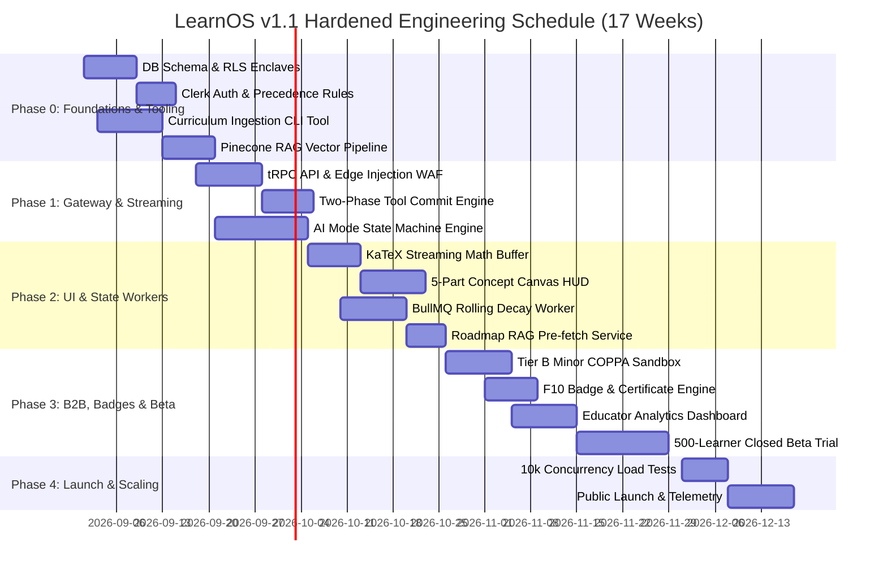
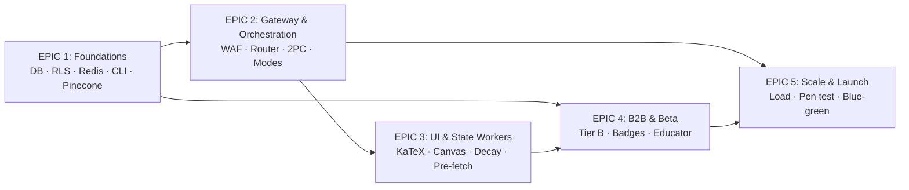

# Engineering Plan & Execution Roadmap
## LearnOS — The Adaptive AI Tutor Platform
**Version:** 1.1 (Hardened Schedule) | **Status:** Approved | **Date:** August 2026
**Owner:** Engineering Lead & Technical Project Management | **Framework:** AI-Native Startup Framework §9
**Parent Documents:** [02_LearnOS-PRD.md](./02_LearnOS-PRD.md) · [03_LearnOS-AI-System-Specification.md](./03_LearnOS-AI-System-Specification.md) · [04_LearnOS-TDD.md](./04_LearnOS-TDD.md) · [05_LearnOS-Schema-Data-Model.md](./05_LearnOS-Schema-Data-Model.md) · [06_LearnOS-Design-Brief.md](./06_LearnOS-Design-Brief.md)

---

> [!IMPORTANT]
> **v1.1 Schedule Hardening (Audit Revisions Applied):**
> 1. **Curriculum Ingestion Tooling**: Dedicated CLI parser task added to Sprint 0 to validate syllabus DAG prerequisites before vector indexing.
> 2. **Streaming Error Boundaries**: KaTeX live streaming buffer and injection sanitizer added to Sprints 1 & 2.
> 3. **Rolling Partitioned Decay Worker**: BullMQ chunked background processor scheduled in Sprint 2.
> 4. **F10 Credentialing Restored**: Badge schema and PDF/SVG certificate generation engine scheduled in Sprint 3.
> 5. **Two-Phase Commit Protocol**: Server-side tool execution pipeline scheduled in Sprint 1.

---

## Table of Contents

1. [Purpose & Engineering Principles](#1-purpose--engineering-principles)
2. [System Build Order & Milestone Phasing](#2-system-build-order--milestone-phasing)
3. [Epics, Tasks & Granular Subtasks](#3-epics-tasks--granular-subtasks)
4. [Dependency Graph & Critical Path](#4-dependency-graph--critical-path)
5. [Prerequisites & Technical Pre-flight](#5-prerequisites--technical-pre-flight)
6. [Technical Risk Management](#6-technical-risk-management)
7. [Testing Strategy & Quality Gates](#7-testing-strategy--quality-gates)
8. [Definition of Done (DoD)](#8-definition-of-done-dod)
9. [Deployment & Infrastructure Requirements](#9-deployment--infrastructure-requirements)
10. [Environment Configuration & Secrets Matrix](#10-environment-configuration--secrets-matrix)
11. [Database Migration Strategy](#11-database-migration-strategy)
12. [Parallelisation of AI Engineering Work](#12-parallelisation-of-ai-engineering-work)
13. [Engineering Plan Validation](#13-engineering-plan-validation)

---

## 1. Purpose & Engineering Principles

This plan converts the approved PRD/AI-Spec/TDD into an executable build order. It is operationalised sprint-by-sprint in [08_LearnOS-Sprint-Execution-Plan.md](./08_LearnOS-Engineering-Plan.md) → see [08_LearnOS-Sprint-Execution-Plan.md](./08_LearnOS-Sprint-Execution-Plan.md). Governing principles:

1. **Deterministic core first** — schema, state machine and pure engines before UI polish.
2. **Security enclaves from day one** — RLS ships with the migration that creates guarded tables.
3. **Every epic exits through a test gate** — no sprint closes on untested code.
4. **Cost ceilings are build-time constraints**, not post-hoc audits.

---

## 2. System Build Order & Milestone Phasing

---

## 3. Epics, Tasks & Granular Subtasks

### EPIC 1: Infrastructure, Tooling & Foundations (Sprint 0)
- [ ] **TASK 1.1: Database Provisioning & Prisma ORM**
  - Subtask 1.1.1: Provision Supabase PostgreSQL with Supavisor pooling (transaction mode) + direct connection for migrations; enable native RLS.
  - Subtask 1.1.2: Apply `20260822_learnos_initial_schema.sql` migration including Badge and Certificate models.
  - Subtask 1.1.3: Generate Prisma Client types and test RLS Tier B Minor transcript privacy policies.
- [ ] **TASK 1.2: Redis Cache & Session Mutex Lock**
  - Subtask 1.2.1: Provision Upstash Redis cluster.
  - Subtask 1.2.2: Implement single-active-session concurrency mutex (`lock:session:user:{userId}`).
  - Subtask 1.2.3: Configure BullMQ rolling decay queue.
- [ ] **TASK 1.3: Curriculum Ingestion CLI & Pinecone Vector Store**
  - Subtask 1.3.1: Build `scripts/ingest-curriculum.ts` CLI tool to validate DAG prerequisite integrity.
  - Subtask 1.3.2: Initialize `learnos-curriculum-rag` serverless index.
  - Subtask 1.3.3: Ingest verified syllabus nodes for GCSE Maths, Python, and Economics.

---

### EPIC 2: Streaming Gateway & AI Orchestration (Sprint 1)
- [ ] **TASK 2.1: Asymmetric Model Gateway & Dynamic Escalation**
  - Subtask 2.1.1: Implement LangGraph state machine with dynamic Socratic escalation to GPT-4o on struggle.
  - Subtask 2.1.2: Configure static prompt prefix caching headers (1,100 tokens).
  - Subtask 2.1.3: Build automatic failover circuit breaker (GPT-4o $\rightarrow$ Claude 3.5 Sonnet).
- [ ] **TASK 2.2: Two-Phase Commit Streaming Route**
  - Subtask 2.2.1: Build Edge SSE route with Edge Prompt Injection Sanitizer.
  - Subtask 2.2.2: Implement server-side tool execution for `commit_state_checkpoint`.
  - Subtask 2.2.3: Wire atomic PostgreSQL transaction commit before `checkpoint_confirmed` token.

---

### EPIC 3: Front-End Workspace, KaTeX Buffer & State Engine (Sprint 2)
- [ ] **TASK 3.1: KaTeX Streaming Error Boundary**
  - Subtask 3.1.1: Build `KaTeXStreamBuffer.tsx` buffering incomplete `$$...$$` tokens mid-stream.
  - Subtask 3.1.2: Implement 3-column responsive workspace (Sidebar, Center Stage, Right HUD).
  - Subtask 3.1.3: Wire `OpenDyslexic` neurodiversity font toggle.
- [ ] **TASK 3.2: 5-Part Concept Canvas & 3-Strike Circuit Breaker**
  - Subtask 3.2.1: Build `ConceptDeliveryCard.tsx` with interactive Check-In widget.
  - Subtask 3.2.2: Implement 3-strike scaffolding circuit breaker (pivots to prerequisite on 3rd failure).
- [ ] **TASK 3.3: Rolling Ebbinghaus Decay Worker & RAG Pre-fetch**
  - Subtask 3.3.1: Implement BullMQ worker processing 500-user cursor chunks continuously.
  - Subtask 3.3.2: Build Step 4 Roadmap RAG pre-fetch service writing to Redis cache.

---

### EPIC 4: B2B Enclaves, Credentialing & Closed Beta (Sprint 3)
- [ ] **TASK 4.1: F10 Badge & Certificate Generation**
  - Subtask 4.1.1: Build badge unlock evaluator triggered on concept mastery.
  - Subtask 4.1.2: Implement verifiable PDF/SVG certificate generation engine.
- [ ] **TASK 4.2: Tier B Minor Sandbox (COPPA/GDPR-K)**
  - Subtask 4.2.1: Implement PII scrubber stripping names, emails, and phone numbers.
  - Subtask 4.2.2: Enforce Tier B transcript lock against Educator consoles without verified consent.
- [ ] **TASK 4.3: Educator Dashboard & Closed Beta**
  - Subtask 4.3.1: Build cohort misconception matrix and syllabus topic locking tools.
  - Subtask 4.3.2: Launch 500-learner closed beta trial.

---

### EPIC 5: Load Testing, Security Audit & Launch (Sprint 4)
- [ ] **TASK 5.1: 10k Concurrency Load Testing**
  - Subtask 5.1.1: Run k6 load test simulating 10,000 concurrent streaming turns.
  - Subtask 5.1.2: Verify zero database locking during decay worker execution.
- [ ] **TASK 5.2: Security Penetration Test & Production Deploy**
  - Subtask 5.2.1: Conduct external penetration testing and prompt injection audits.
  - Subtask 5.2.2: Execute blue-green production deployment on AWS ECS + Vercel Edge.

---

## 4. Dependency Graph & Critical Path

**Critical path:** EPIC 1 → EPIC 2 → EPIC 3 → EPIC 5. EPIC 4 parallelises after EPIC 3's state-worker APIs stabilise.

---

## 5. Prerequisites & Technical Pre-flight

All items must be ✅ before Sprint 0 exit review:

| # | Prerequisite | Owner | Evidence |
| :--- | :--- | :--- | :--- |
| P1 | Supabase project (verified ✅) + pooled/direct connection strings | Infra | `DATABASE_URL` / `DIRECT_URL` in secret store |
| P2 | Upstash Redis cluster (multi-AZ) | Infra | `REDIS_URL` reachable; TLS on |
| P3 | Pinecone serverless index `learnos-curriculum-rag` created | AI Eng | Index visible in console |
| P4 | Clerk app + JWT template + COPPA age-gate flow stubbed | BE | Test auth round-trip |
| P5 | OpenAI + Anthropic keys with spend caps | AI Eng | Keys in vault; cap alerts wired |
| P6 | Docker Desktop running locally (PG16 + Redis for integration gates) | Eng | `docker compose up` green |
| P7 | Git repo initialised; branch protection on `main` | Lead | CI status checks required |
| P8 | Curriculum source content locked for v1 subjects (GCSE/A-Level, Doc 09) | Product | Fixture JSONs under `curricula/` |
| P9 | Secrets matrix (§10) reviewed; no plaintext secrets in repo | Lead | Audit grep clean |

---

## 6. Technical Risk Management

| ID | Risk | Severity | Mitigation | Owner |
| :--- | :--- | :--- | :--- | :--- |
| B-01 | Client disconnect causes state de-sync | High | Two-phase server-side commit (Sprint 1) | BE |
| B-02 | Nocturnal decay job locks tables | High | Rolling BullMQ 500-user chunks (Sprint 2/4) | BE |
| B-03 | Tenant precedence breach (minor data) | Critical | RLS + precedence resolver + truth-table gate (S0/S5) | BE |
| B-04 | Live Pinecone latency in tutoring loop | Medium | Step-4 Redis pre-fetch (Sprint 2/4) | AI |
| M-01 | Socratic reasoning depth vs token cost | High | Dynamic escalation w/ hysteresis (Sprint 1/4) | AI |
| M-04 | STEM hallucination | High | Curriculum RAG grounding + golden evals (S6) | AI |
| O-01 | Exam-board spec drift (annual reforms) | Medium | Versioned curriculum packages; re-ingest runbook (Doc 09) | Product |

---

## 7. Testing Strategy & Quality Gates

- **Code Coverage**: $\ge 85\%$ across backend API routes and workers.
- **AI Golden Eval Pass Rate**: $\ge 95\%$ on 200 standard curriculum benchmark prompts.
- **KaTeX Stream Buffer Stress Test**: 100% pass on synthetic fragmented LaTeX stream fixtures.

## 8. Definition of Done (DoD)

A feature is **Done** when all apply:

- [ ] Acceptance criteria met on staging (not localhost-only)
- [ ] Tests written and green: unit + integration for touched paths; coverage gate ≥85% holds
- [ ] Contract schemas versioned; no unversioned boundary changes
- [ ] Observability emitted (logs/metrics/traces/cost rows) for new paths
- [ ] Security review if touching auth, RLS, PII, or injection surfaces
- [ ] Docs/runbook updated; feature flag default documented
- [ ] Reviewed by second engineer; CI gates G1/G2/G3 green

---

## 9. Deployment & Infrastructure Requirements

| Environment | Purpose | Topology |
| :--- | :--- | :--- |
| **dev (local)** | Engineering | Docker Compose: Postgres 16 + Redis 7; mock LLM transport for offline tests |
| **staging** | Sprint demos, beta prep, eval runs | Vercel preview/deployment + Supabase staging project + Upstash dev + Pinecone staging index |
| **production** | GA | Vercel Edge + AWS ECS Fargate (eu-west-1) + Supabase prod (Supavisor pooler) + Upstash multi-region + Pinecone serverless |

- **Database**: Supabase PostgreSQL — native RLS enforced under non-superuser app roles; migrations run over `DIRECT_URL` only.
- **Pooling**: Supavisor transaction mode (`pgbouncer=true` in Prisma pooled URL); prepared-statement compatibility handled by Prisma driver adapter.
- **Auth**: Clerk JWTs validated at Edge; tenant claims mirrored into RLS GUCs per request.
- **IaC**: Compose files for local; cloud resources provisioned via dashboard + documented in runbooks (v1 scope — Terraform deferred post-GA).

---

## 10. Environment Configuration & Secrets Matrix

Secrets live ONLY in the platform secret stores (Vercel env config, ECS task definitions, local `.env` which is gitignored). Never in repo.

| Variable | Scope | Consumer | Notes |
| :--- | :--- | :--- | :--- |
| `DATABASE_URL` | all envs | Prisma runtime | Supabase **pooled** URL (:6543, `?pgbouncer=true`) |
| `DIRECT_URL` | CI / migration jobs | Prisma migrate | Supabase **direct** URL (:5432) |
| `SUPABASE_URL` / `SUPABASE_SERVICE_ROLE_KEY` | server only | Storage/Realtime addons (S5 certificates) | Service role key = bypasses RLS — server-restricted |
| `REDIS_URL` | all envs | Mutex, queues, RAG cache | Upstash reds TLS URL |
| `PINECONE_API_KEY` / `PINECONE_INDEX` | server | T01 grounding, ingestion CLI | Serverless index name per env |
| `CLERK_SECRET_KEY` / `CLERK_PUBLISHABLE_KEY` | server/client | Auth | Per-environment Clerk instances |
| `OPENAI_API_KEY` / `ANTHROPIC_API_KEY` | server | Model gateway | Spend caps + alerts mandatory |
| `LANGFUSE_PUBLIC/SECRET_KEY`, `SENTRY_DSN`, `POSTHOG_KEY` | server/client | Observability | Tier B: no external telemetry without scrub pass |
| `SESSION_MUTEX_TTL_S` | tuning | Session gateway | Default 30 |

Rotation: provider keys quarterly or on suspicion; service-role key immediately on any exposure. CI fails if `.env` is staged.

---

## 11. Database Migration Strategy

1. **Forward-only** SQL migrations in `db/migrations/` named `YYYYMMDD_<slug>.sql`; never edit applied migrations.
2. Migrations ship together with their RLS policies, indexes, and grants — one atomic unit.
3. Prisma schema is the modelling source of truth; hand-written DDL is kept parity-checked via introspection diff in CI (S0-T1).
4. Apply path: local compose → Supabase staging branch → production (during deploy window, blue-green compatible).
5. Destructive changes require two-phase rollout: additive migration first, backfill, then cutover migration in a later release.
6. Every migration is tested against a fresh database AND a database restored from previous backup state.

---

## 12. Parallelisation of AI Engineering Work

Two lanes run concurrently from Sprint 2 onward (mirrored in Doc 08 §7):

| Lane | Focus | Sync point |
| :--- | :--- | :--- |
| **BE/AI lane** | Mode engines, tools, decay worker, RAG pre-fetch, evals | SSE event contract + checkpoint schemas frozen at end of Sprint 1 |
| **FE lane** | Workspace shell, KaTeX buffer, intake, HUD | Consumes contract mocks; joins BE lane at Sprint 4 integration |

Contract-first rule makes the lanes safe: FE builds against published Zod schemas + mocked streams; integration debt is paid in Sprint 4's E2E gate.

---

## 13. Engineering Plan Validation

This plan is validated continuously:

1. **Traceability**: every PRD feature (F1–F11), hardened fix (B/M IDs) and quality gate maps to exactly one owning sprint (Doc 08 §9–10) — no orphan requirements.
2. **Exit reviews**: each sprint closes only when its testing gates and DoD checklist pass on staging.
3. **Schedule guardrails**: critical path S0→S1→S2→S4→S6→S7 monitored weekly; slippage >3 days triggers scope re-triage, never silent compression of test gates.
4. **Cost/latency budgets** verified empirically in S6 replay before GA sign-off.

---

*Document Version: 1.2 (Supabase stack + completed sections) | Owner: Engineering Team | Framework: §9.1–9.15*
