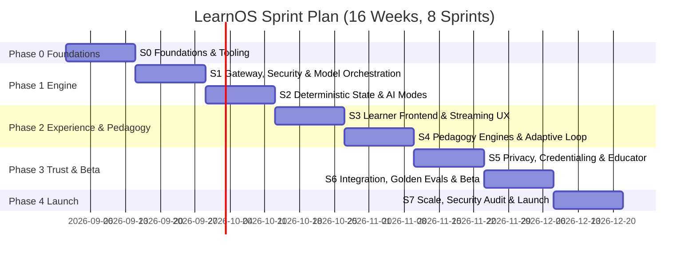
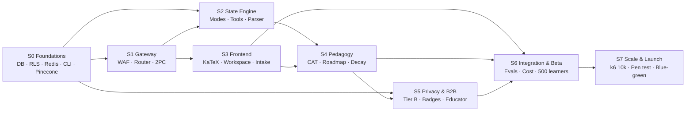

# Sprint Execution Plan & Program Structure
## LearnOS — The Adaptive AI Tutor Platform
**Version:** 1.0 | **Status:** Active | **Date:** August 2026
**Owner:** Engineering Lead & Technical Project Management
**Parent Documents:** [07_LearnOS-Engineering-Plan.md](./07_LearnOS-Engineering-Plan.md) · [02_LearnOS-PRD.md](./02_LearnOS-PRD.md) · [03_LearnOS-AI-System-Specification.md](./03_LearnOS-AI-System-Specification.md) · [04_LearnOS-TDD.md](./04_LearnOS-TDD.md) · [05_LearnOS-Schema-Data-Model.md](./05_LearnOS-Schema-Data-Model.md)

---

> [!NOTE]
> **Relationship to Engineering Plan v1.1:** This document decomposes the approved Phase 0–4 roadmap (§2, §3 of Doc 07) into **8 executable sprints** with per-sprint entry/exit criteria, testing gates, and Definition of Done. Scope and sequencing are unchanged; the decomposition adds the previously implicit pedagogy-engine build tracks (F2, F4, F6–F8) and a dedicated integration/eval sprint so every Must-Have requirement has an owning sprint and a named test gate. Any date shift relative to Doc 07 stays within the same December 2026 launch window.

---

## Table of Contents

1. [Program Overview & Sprint Cadence](#1-program-overview--sprint-cadence)
2. [Engineering Principles (Pragmatic System Design)](#2-engineering-principles-pragmatic-system-design)
3. [Algorithm & Logic Building Standards](#3-algorithm--logic-building-standards)
4. [Testing Strategy & Robustness Standards](#4-testing-strategy--robustness-standards)
5. [Global Quality Gates](#5-global-quality-gates)
6. [Sprint Map & Timeline](#6-sprint-map--timeline)
7. [Dependency Graph & Critical Path](#7-dependency-graph--critical-path)
8. [Sprint Document Index](#8-sprint-document-index)
9. [Feature → Sprint Traceability Matrix](#9-feature--sprint-traceability-matrix)
10. [Risk Burn-Down Mapping](#10-risk-burn-down-mapping)
11. [Definition of Done (Program-Level)](#11-definition-of-done-program-level)

---

## 1. Program Overview & Sprint Cadence

| Attribute | Value |
| :--- | :--- |
| **Duration** | 16 weeks (8 sprints × 2 weeks) |
| **Window** | 2026-09-01 → 2026-12-21 |
| **Cadence** | 2-week sprints; hard exit review + demo on final Friday |
| **Team shape** | 1 BE/AI, 1 FE, 1 Infra/Data (shared QA ownership) |
| **Launch target** | Public GA in Sprint 7, inside Doc 07's Dec 8–18 window |

---

## 2. Engineering Principles (Pragmatic System Design)

These principles are binding on every sprint and enforced at code review + CI:

1. **Pure core, imperative shell.** All business logic (state transitions, DAG validation, decay math, CAT selection, roadmap planning, precedence rules) lives in pure, deterministic functions with zero I/O. I/O (DB, Redis, Pinecone, LLM SDKs) is confined to thin adapters at the edges.
2. **Determinism over LLM memory.** Session state is database-backed only (PRD upgrade #2). LLM output is treated as untrusted input: parsed, validated against Zod/Pydantic contracts, then committed atomically (two-phase protocol).
3. **Contract-first.** Every boundary (checkpoint payloads, curriculum JSON, tool calls, SSE events) has a versioned schema committed before implementation. Breaking changes require a schema version bump.
4. **Idempotency everywhere.** Workers (decay, spaced-rep, ingestion) are cursor-based, chunked, and safe to re-run. Every write path tolerates retry without duplication (unique keys or upserts).
5. **Fail-safe defaults.** Tenant precedence resolves Tier B > A > C. When context is missing, the system fails closed (locked), never open.
6. **One migration path.** Schema changes only through ordered, forward-only migrations in `db/migrations/`; RLS policies ship with the migration that creates their tables.
7. **Observability is a feature.** Every sprint ships its metrics/logs/traces (Langfuse tokens+cost, Sentry errors, PostHog pedagogy events) — not bolted on in Sprint 7.
8. **Feature-flag risky paths.** Model escalation, circuit breakers, and beta cohorts are flag-controlled for instant rollback during beta/load phases.

---

## 3. Algorithm & Logic Building Standards

| Area | Standard | Verified by |
| :--- | :--- | :--- |
| **Graph algorithms** (curriculum DAG, roadmap packing) | Kahn's topological sort; cycle detection with full cycle-path reporting (not just boolean); O(V+E) budgets documented in-code | Unit + property tests (`dag.test.ts`, `roadmap.test.ts`) |
| **State machines** (6 AI modes, 3-strike breaker) | Explicit transition tables as data; illegal transitions throw typed errors; no hidden states | Exhaustive pairwise transition tests |
| **Numeric models** (Ebbinghaus decay, mastery, CAT calibration) | Formula isolated in pure module with cited constants; golden-value tests incl. boundary conditions (floor 10.0, status cut-offs 50/80) | Golden math fixtures |
| **Parsers** (checkpoints, LaTeX stream, PII scrubber) | Property-based/fuzz testing; never regex-only on security paths (scrubber uses layered rules + allowlist) | Fuzz suites + red-team corpora |
| **Concurrency** (session mutex, workers) | Atomic acquire/release (Lua-equivalent single-round-trip ops); TTL heartbeat; deadlock-free by construction | Race-condition tests, chaos kill tests |
| **Planning** (CAT question selection, roadmap time-packing) | Deterministic given identical inputs + seed; complexity stated; tie-breaking explicit | Simulation (Monte Carlo synthetic learners) |

---

## 4. Testing Strategy & Robustness Standards

### 4.1 Test Pyramid (enforced ratio ≈ 70/20/10)

| Layer | Scope | Tooling | Gate |
| :--- | :--- | :--- | :--- |
| **Unit (pure core)** | All logic modules | Vitest (+ fast-check for property tests) | ≥85% coverage on `src/**` excluding adapters (Doc 07 §7) |
| **Integration** | Adapters against real deps: Postgres 16 (Docker) for DDL+RLS, Redis for mutex/queues, mocked LLM transport | Vitest + Testcontainers-style docker compose | 100% pass; RLS truth table fully covered |
| **Contract** | Zod schemas ↔ SSE events ↔ tool payloads ↔ curriculum JSON | Snapshot + round-trip tests | No unversioned schema drift |
| **AI Golden Evals** | 200 benchmark learner dialogues vs rubric | Eval harness (Sprint 6) | ≥95% pass; factual accuracy ≥99.2% (Doc 03 §13) |
| **E2E** | Critical journeys: intake→calibration→teach→socratic→practice→review; reconnect/resume | Playwright | 100% pass on PRs touching those flows |
| **Load/Chaos** | 10k concurrent SSE; worker kill/resume; model timeout failover | k6 + fault injection (Sprint 7) | Doc 07 §7 + §16 targets |

### 4.2 Robustness Requirements (per component class)

- **Every parser:** malformed-input suite (truncated, injected, oversized, unicode-hostile) must degrade safely, never crash the stream.
- **Every external call:** timeout budget + fallback declared (LLM >4s → Claude 3.5 Sonnet; Redis down → fail closed on locks, serve stale RAG).
- **Every worker:** kill -9 mid-chunk must resume from last committed cursor with zero duplicate side-effects (tested in S4).
- **Every security control:** adversarial fixture corpus checked into repo; regressions block merge.

---

## 5. Global Quality Gates

| # | Gate | Threshold | Enforced from |
| :--- | :--- | :--- | :--- |
| G1 | Unit/integration coverage | ≥85% backend routes & workers | Sprint 0 |
| G2 | Type safety | `tsc --noEmit` clean; no `any` on boundaries | Sprint 0 |
| G3 | Migration discipline | Forward-only; applied cleanly on fresh + upgraded DB | Sprint 0 |
| G4 | RLS truth table | 100% scenarios pass | Sprint 0 (re-run S5, S7) |
| G5 | KaTeX fragmented-stream stress | 100% synthetic fixtures render or safely degrade | Sprint 3 |
| G6 | Golden eval pass rate | ≥95% / 200 dialogues | Sprint 6 |
| G7 | Cost ceiling | ≤£0.05 blended inference / 60-min session | Sprint 6 |
| G8 | Latency | P95 first-token <1,200ms | Sprint 7 |
| G9 | Load | 10k concurrent streams, zero DB locks during decay | Sprint 7 |
| G10 | Security | Zero open criticals from pen test / injection audit | Sprint 7 |

---

## 6. Sprint Map & Timeline

---

## 7. Dependency Graph & Critical Path

**Critical path:** S0 → S1 → S2 → S4 → S6 → S7.
**Parallel lanes:** FE lane (S3) overlaps S2; Privacy/B2B lane (S5) starts while S4 hardening completes (Doc 07 §12).

---

## 8. Sprint Document Index

| Sprint | Document | Phase | Window | Primary Outcome |
| :--- | :--- | :--- | :--- | :--- |
| **S0** | [Sprint-00_Foundations-and-Tooling.md](./sprints/Sprint-00_Foundations-and-Tooling.md) | 0 | Sep 01–14 | Schema+RLS live, Redis mutex, DAG-valid curriculum ingested |
| **S1** | [Sprint-01_Gateway-Security-Model-Orchestration.md](./sprints/Sprint-01_Gateway-Security-Model-Orchestration.md) | 1 | Sep 15–28 | Secured SSE gateway, asymmetric routing, two-phase commit |
| **S2** | [Sprint-02_Deterministic-State-Engine-AI-Modes.md](./sprints/Sprint-02_Deterministic-State-Engine-AI-Modes.md) | 1 | Sep 29–Oct 12 | 6-mode state machine, tools T01–T05, checkpoint parser |
| **S3** | [Sprint-03_Learner-Frontend-Streaming-UX.md](./sprints/Sprint-03_Learner-Frontend-Streaming-UX.md) | 2 | Oct 13–26 | Crash-proof streaming workspace + hybrid intake (F1) |
| **S4** | [Sprint-04_Pedagogy-Engines-Adaptive-Loop.md](./sprints/Sprint-04_Pedagogy-Engines-Adaptive-Loop.md) | 2 | Oct 27–Nov 09 | Full adaptive loop F2–F8 + decay worker + RAG pre-fetch |
| **S5** | [Sprint-05_Privacy-Credentialing-Educator.md](./sprints/Sprint-05_Privacy-Credentialing-Educator.md) | 3 | Nov 10–23 | Tier B enclave, F10 badges/certs, educator portal (F11) |
| **S6** | [Sprint-06_Integration-Golden-Evals-Beta.md](./sprints/Sprint-06_Integration-Golden-Evals-Beta.md) | 3 | Nov 24–Dec 07 | Eval gates green, cost verified, 500-learner beta run |
| **S7** | [Sprint-07_Scale-Security-Launch.md](./sprints/Sprint-07_Scale-Security-Launch.md) | 4 | Dec 08–21 | 10k load passed, pen test clean, public GA |

---

## 9. Feature → Sprint Traceability Matrix

| Requirement | Feature | Built In | Verified By (Gate) |
| :--- | :--- | :--- | :--- |
| F1 Hybrid intake (<60s rapid + conversational) | Profiler Mode 1 | S3 (UI) + S2 (parser) | Playwright intake E2E; <60s timing assert |
| F2 CAT diagnostic | Diagnostician Mode 2 | S4 | Monte Carlo calibration sim ≥90% band hit |
| F3 Learning DNA & deterministic state | Modes 2–6 + schema | S0 (schema) + S2 (injection) | Checkpoint round-trip integration tests |
| F4 Time-scoped roadmap w/ prereqs | Tutor Step 4 | S4 | Planner unit + determinism tests |
| F5 RAG-grounded 5-part delivery | Tutor Mode 3 | S4 (engine) + S3 (canvas UI) | Golden evals; grounding citation asserts |
| F6 Socratic scaffolding + escalation | Socratic Mode 4 | S4 | Transition-table tests; escalation trigger tests |
| F7 3-tier practice + remediation | Assessor Mode 5 | S4 | Uniqueness-window tests; verdict rubric fixtures |
| F8 Progress matrix + spaced rep | Reviewer Mode 6 + T04 | S4 | Interval math goldens; Redis ZSET integration |
| F10 Badges & certificates | Credentialing | S5 | Unlock rule table; cert verification round-trip |
| F11 Educator portal & analytics | Tier C console | S5 | Aggregation-only-for-minors property test |
| Tier B COPPA/GDPR-K sandbox | Cross-cutting | S0 (RLS) + S5 (PII/consent) | RLS truth table; PII red-team corpus |
| Injection defense / WAF | Cross-cutting | S1 | Adversarial prompt fixture suite |
| Two-phase state commit | B-01 fix | S1 | Client-kill-mid-stream integration test |
| Rolling decay worker | B-02 fix | S4 | Chunk resume test; zero-lock assertion |
| Tenant precedence B>A>C | B-03 fix | S0 + S5 | Precedence truth table |
| RAG pre-fetch @ Step 4 | M-04/B-04 fix | S4 | Redis hit-latency integration test (<3ms cache path) |
| Model escalation + failover | M-01 fix | S1 | Fault-injection (timeout/5xx) tests |
| 3-strike circuit breaker | Pedagogy safety | S4 | Strike-counter state machine tests |
| Single-session mutex | Concurrency | S0 | Race-condition tests (dual acquire) |
| Golden eval framework | Doc 03 §12 | S6 | G6 ≥95% |
| 10k concurrency + pen test + GA | Doc 07 Phase 4 | S7 | G8–G10 |

**Post-v1 backlog (explicitly not in these sprints, per PRD §14/MoSCoW):** React Native parity app, offline SQLite cache, voice tutoring, video generation, peer chat, essay grading.

---

## 10. Risk Burn-Down Mapping

| Risk (Doc 04/07 IDs) | Mitigating Sprint | Residual Verification |
| :--- | :--- | :--- |
| B-01 client-disconnect state de-sync | S1 | Kill-stream integration test (G-gate in S1 DoD) |
| B-02 nocturnal decay table locks | S4 | `pg_stat` zero-lock assertion + resume test |
| B-03 tenant precedence breach | S0, S5 | RLS truth table re-run at S5 & S7 exits |
| B-04 Pinecone latency bottleneck | S4 | Pre-fetch cache-hit latency test |
| M-01 Socratic reasoning depth vs cost | S1, S4 | Escalation trigger tests + cost replay (G7) |
| M-04 STEM hallucination | S0, S4, S6 | Grounding citation asserts + golden evals (G6) |
| Onboarding churn | S3 | <60s rapid-intake E2E timing |
| Token cost explosion | S1, S6 | Per-turn cost audit rows + session replay report |
| Minor compliance breach (Critical) | S0, S5, S6 | Consent-token tamper tests; beta cohort includes minors only after S5 exit |

---

## 11. Definition of Done (Program-Level)

A sprint is **closed** only when all of the following hold:

- [ ] All sprint-doc acceptance criteria met (see per-sprint docs)
- [ ] Coverage G1 ≥85% on new backend code; `tsc --noEmit` clean (G2)
- [ ] New schemas shipped as forward-only migrations incl. RLS (G3)
- [ ] Observability shipped: metrics, logs, traces, cost rows for new paths
- [ ] Runbook updated for any new operational component (worker, queue, cron)
- [ ] Demo performed against staging (not localhost) with seeded realistic data
- [ ] Exit review held; blockers carry-over triaged into next sprint with owner

---

*Sprint Execution Plan v1.0 | Governs docs `sprints/Sprint-00…07` | Framework: §9.1–9.15*
