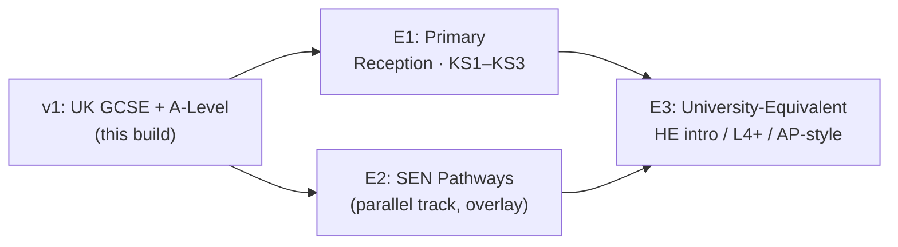

# Curriculum Coverage Strategy
## LearnOS — The Adaptive AI Tutor Platform
**Version:** 1.0 | **Status:** Approved | **Date:** August 2026
**Owner:** Product & Curriculum Engineering | **Framework:** AI-Native Startup Framework §7/§8 extension
**Parent Documents:** [02_LearnOS-PRD.md](./02_LearnOS-PRD.md) · [05_LearnOS-Schema-Data-Model.md](./05_LearnOS-Schema-Data-Model.md) · [07_LearnOS-Engineering-Plan.md](./07_LearnOS-Engineering-Plan.md)

---

> [!IMPORTANT]
> **v1 Scope Decision (Program Directive):** The first iteration covers **UK GCSE and A-Level qualifications only**. This concentrates the verified-corpus RAG pipeline where grounding matters most (STEM hallucination risk, PRD §7.1) and matches the beta persona base (Zara, GCSE). Expansion proceeds in phases: **Reception/Primary (KS1–KS3) → Special Educational Needs (SEN) pathways → University-equivalent courses**. Each phase has hard entry gates — coverage never expands on an unstable foundation.

---

## Table of Contents

1. [Expansion Roadmap](#1-expansion-roadmap)
2. [v1 Launch Subject Matrix](#2-v1-launch-subject-matrix)
3. [Identifier Conventions](#3-identifier-conventions)
4. [Curriculum Package Format](#4-curriculum-package-format)
5. [Phase Entry Gates](#5-phase-entry-gates)
6. [Spec Drift & Annual Re-Ingest (O-01)](#6-spec-drift--annual-re-ingest-o-01)
7. [Sprint Impact Summary](#7-sprint-impact-summary)

---

## 1. Expansion Roadmap



| Phase | Audience | Why this order |
| :--- | :--- | :--- |
| **v1** | Exam candidates 14–18 | Accredited specs = ground-truth corpora; highest hallucination cost; Tier B minor flows proven here first |
| **E1 Primary** | Ages 4–14 | Reuses Tier B enclave + parental consent built for minors; adds early-years pedagogy modes |
| **E2 SEN** | Cross-age overlay (not a separate phase of content) | Accessibility is an *adaptation layer* over existing curricula — OpenDyslexic, pacing, scaffold depth, engagement-model alignment |
| **E3 University** | Adult learners | Tier A/C economics apply; requires new accreditation sources and longer session formats |

---

## 2. v1 Launch Subject Matrix

| Priority | Subject | Board | `subject_id` | Rationale |
| :--- | :--- | :--- | :--- | :--- |
| **P0** | GCSE Mathematics | Edexcel | `gcse_maths_edexcel` | Highest-volume UK tutoring demand; dense prerequisite DAG showcases adaptive engine |
| **P0** | GCSE Combined Science | AQA | `gcse_combined_science_aqa` | Zara persona coverage; biology/chemistry/physics strands |
| **P0** | A-Level Mathematics | Edexcel | `alevel_maths_edexcel` | Validates cross-stage prereq chains (GCSE→A-Level bridge diagnostics) |
| P1 (stretch, post-beta) | GCSE English Language | AQA | `gcse_english_lang_aqa` | Non-STEM grounding validation |
| P1 (stretch, post-beta) | A-Level Economics | Edexcel A | `alevel_economics_edexcel` | Maya-adjacent demand probe |

**Rule:** no subject enters Pinecone until its package passes the ingestion CLI's full DAG validation (`--validate-dag`, Sprint 0).

---

## 3. Identifier Conventions

```
subject_id   = {stage}_{subject}_{board}        e.g. alevel_maths_edexcel
concept_id   = {subject_id}.{strand}.{topic}.{nn}
             e.g. gcse_maths_edexcel.number.fractions.03
spec_ref     = official board spec point        e.g. "3.2a"
```

- All IDs ≤ `varchar(64)` (schema constraint, Doc 05).
- Concept IDs are immutable once published; retirements deprecate rather than reuse.
- Cross-stage prerequisites (e.g. GCSE surds → A-Level binomial expansion) are legal edges; the CLI flags them for SME review rather than rejecting.

---

## 4. Curriculum Package Format

One JSON file per subject under `curricula/`:

```jsonc
{
  "package_version": "2026-edexcel-maths-v1",     // O-01 re-ingest handle
  "subject": { "id": "gcse_maths_edexcel", "title": "GCSE Mathematics", "board": "edexcel", "stage": "gcse", "category": "mathematics" },
  "nodes": [{
    "id": "gcse_maths_edexcel.number.fractions.03",
    "title": "Multiplying and dividing fractions",
    "difficulty_level": 4,
    "spec_ref": "3.2a",
    "estimated_minutes": 12,
    "canonical_definitions": [{ "text": "...", "latex": "a/b * c/d = ac/bd" }],
    "misconceptions": ["dividing flips the wrong fraction"],
    "worked_examples": ["..."]
  }],
  "edges": [["gcse_maths_edexcel.number.fractions.01", "gcse_maths_edexcel.number.fractions.03"]]  // [prerequisite, concept]
}
```

Validation pipeline (CLI): schema → unique IDs → referential integrity → self-loop rejection → Kahn's cycle detection with path reporting → difficulty-monotonicity warnings → cross-subject edge guard.

---

## 5. Phase Entry Gates

### E1 — Primary (Reception–KS3)
- [ ] Tier B minor enclave + consent flow live since S5, zero privacy incidents through beta
- [ ] Early-reading delivery mode specced (shorter turns, audio-first options, emoji-free tone rules)
- [ ] KS1–KS3 corpus sourced & SME-reviewed; DAG validation green
- [ ] Parental dashboard (consent management) extended for primary age bands

### E2 — SEN Pathways (overlay)
- [ ] OpenDyslexic + WCAG AA shipped (S3 exit) and validated with SEN user testing panel
- [ ] Scaffold-depth configurator: per-learner multipliers on hint laddering, strike thresholds, turn length
- [ ] Engagement Model / SEND specialist review of adaptation rules before any learner enrolment
- [ ] No new corpus required initially — adaptations apply over v1/E1 curricula

### E3 — University-Equivalent
- [ ] Golden evals held ≥95% for two consecutive months on v1 corpus (stability proof)
- [ ] HE/L4 accreditation sources licensed or verified-open; citation coverage ≥98%
- [ ] Session formats extended beyond 90-min cap with cohort analytics opt-in (Tier C)

---

## 6. Spec Drift & Annual Re-Ingest (O-01)

1. Packages are immutable and versioned (`package_version`); boards reform annually.
2. Re-ingest runbook: diff new spec against current package → CLI reports added/retired/moved concepts → SME approves mapping → new package version ingested alongside old (`curriculum_version` metadata enables coexistence) → sessions pin their package at Step 1.
3. Learner DNA survives transitions via concept-migration map produced during diff review.

---

## 7. Sprint Impact Summary

| Sprint | Adjustment from this strategy |
| :--- | :--- |
| **S0** | Seed exactly the three P0 subjects (replaces generic "Maths/Python/Economics"); fixture authoring task added |
| **S4** | CAT question banks must carry `spec_ref` tags; bank minimum-size check per P0 subject |
| **S6** | Golden eval dialogue set sampled only from P0 subject corpus; board-specific rubric variants |
| Post-GA | E1/E2/E3 gates tracked as their own mini-plans (docs to be created per phase kickoff) |

---

*Document Version: 1.0 | Owner: Product & Curriculum Engineering*
