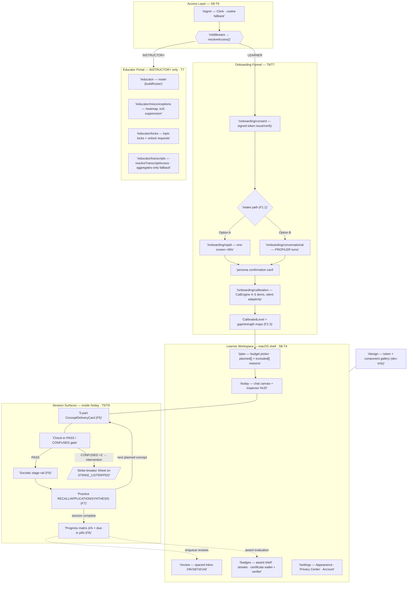
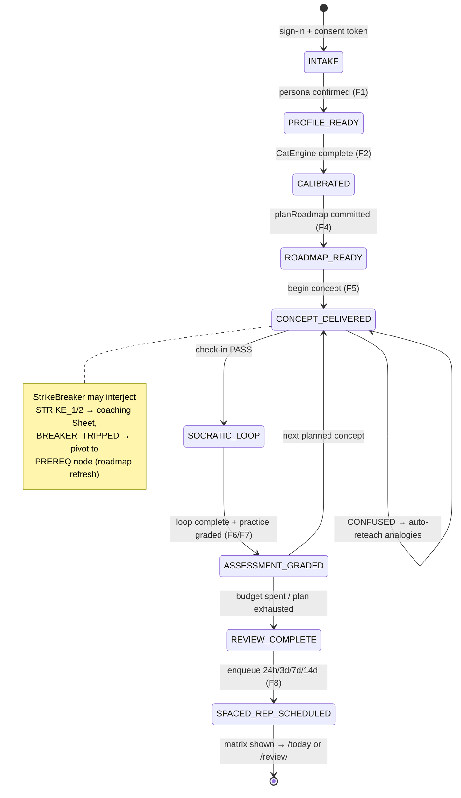

# Sprint 8 — Frontend Experience (macOS Design Language)
**Phase 2 → 4 bridge** | **Window:** 2026-12-22 → 2027-01-04 | **Owner:** FE Eng
**Epic ref:** Doc 07 · TASK 3.1 completion + PRD F1–F8 UI | **Master plan:** [08_LearnOS-Sprint-Execution-Plan.md](../08_LearnOS-Sprint-Execution-Plan.md)
**Supersedes:** Doc 06 §3–§5 *visual* direction (dark-glass slate/indigo) → replaced by Apple macOS Human Interface Guidelines palette, materials and type. Doc 06's *structural* spec (3-column workspace, 5-part concept card, HUD §14, a11y §13) remains normative.

---

## 1. Sprint Goal

Ship the production learner + educator web app as a single Next.js (App Router) deployment that directly imports the platform's engine modules (`src/**`) — no HTTP shim between UI and pedagogy — styled end-to-end with a native-feeling **macOS design system**: system-color palette in light/dark, frosted-glass materials, SF Pro type stack, continuous-corner controls, and restrained spring motion. The Sprint-3 legacy demo (`public/index.html`, `api/turn.ts`) is retired once feature parity is reached.

## 2. Entry Criteria

- Sprints 0–7 merged; golden evals GATE GREEN; `npm run smoke:ga` green.
- SSE event contract frozen (`src/api/sse/turn-route.ts` typed event union).
- Vercel project already connected to the GitHub repo (root deploy today).

## 3. Stack Decision (binding)

| Concern | Choice | Rationale |
| :--- | :--- | :--- |
| Framework | **Next.js 15 App Router**, React 19, TS strict | Vercel-native; RSC for dashboard shells; Route Handlers replace `api/turn.ts` and can `import { runTurn } from '@/src/...'` directly — engines, Zod schemas and cost-audit types shared with zero duplication |
| Styling | **Tailwind CSS v4** driven entirely by CSS custom properties | Tokens live in `tokens.css` (source of truth); Tailwind maps them so no component ever hardcodes a hex |
| State | URL state + React context only; no global store | Server is source of truth (Doc 04 §13); session state resumes from `checkpoint_confirmed` |
| Motion | CSS transitions/keyframes only | HIG motion curves are simple; avoids framer-motion weight |
| Math | KaTeX via stream buffer (Sprint-3 G5 algorithm ported) | Normative requirement; stress corpus carries over |
| Tests | vitest + @testing-library/react + happy-dom; Playwright for e2e/visual | Matches repo tooling; same ≥85% thresholds |

**Layout:** single-root adoption — `app/`, `components/`, `lib/` at repo root next to `src/`. One tsconfig, one typecheck, one deploy.

---

## 4. macOS Design System Spec (normative tokens)

### 4.1 System Colors (`--sys-*`, light / dark)

| Token | Light | Dark | Usage |
| :--- | :--- | :--- | :--- |
| systemBlue | #007AFF | #0A84FF | Primary accent: CTAs, links, focus rings, sent bubbles |
| systemGreen | #34C759 | #30D158 | Mastery SOLID, check-in passed, online |
| systemOrange | #FF9500 | #FF9F0A | Mastery PARTIAL, warnings, struggle state |
| systemRed | #FF3B30 | #FF453A | Mastery NEEDS_WORK, destructive, errors |
| systemPurple | #AF52DE | #BF5AF2 | Socratic mode badge |
| systemTeal | #30B0C7 | #40C8E0 | Assessor mode badge |
| systemIndigo | #5856D6 | #5E5CE6 | Diagnostician mode badge |
| systemMint | #00C7BE | #66D4CF | Review/spaced-rep accents |
| systemYellow | #FFCC00 | #FFD60A | Streaks, stars, highlights |
| gray | #8E8E93 | #98989D | Tertiary icons |
| gray2–gray6 | #AEAEB2→#F2F2F7 | #636366→#1C1C1E | Fills, separators backgrounds |

Semantic aliases (auto-flip with mode): `label` rgba(0,0,0,.85)/rgba(255,255,255,.85) · `secondaryLabel` 55% · `tertiaryLabel` 30% · `separator` rgba(0,0,0,.09)/rgba(255,255,255,.12) · `window` #FFFFFF/#1E1E1E · `sidebarMaterial` (see 4.2) · `textBackground` #FFFFFF/#28282A.

Mastery mapping is fixed: SOLID→green, PARTIAL→orange, NEEDS_WORK→red (replaces Doc 06 emerald/amber/rose).

### 4.2 Materials (NSVisualEffectView equivalents)

| Material | Recipe | Fallback (no backdrop-filter) |
| :--- | :--- | :--- |
| sidebar | blur(40px) saturate(180%) over rgba(246,246,246,.72) / rgba(40,40,42,.72) | solid #F2F2F7 / #2C2C2E |
| hud/inspector | blur(30px) saturate(160%) over rgba(242,242,247,.65) / rgba(44,44,46,.65) | solid gray6 / gray5-dark |
| toolbar/sheet chrome | blur(20px) over rgba(255,255,255,.72) / rgba(30,30,30,.78) | solid white / #1E1E1E |
| popover | material + 1px separator border + shadow `0 10px 40px rgba(0,0,0,.18)` | same minus blur |

All materials respect `prefers-reduced-transparency` → fallback solids.

### 4.3 Typography

Stacks: UI `-apple-system, BlinkMacSystemFont, "SF Pro Text", "SF Pro Display", "Segoe UI", system-ui`; Mono `ui-monospace, "SF Mono", Menlo, monospace`; Accessibility toggle keeps OpenDyslexic (Doc 06 §13).

| Token | Size/Weight | Usage |
| :--- | :--- | :--- |
| largeTitle | 26/700 | Session-complete hero |
| title1 | 22/700 | Concept names |
| title2 | 17/600 | Card titles, section heads |
| headline | 13/600 | Buttons, list rows, badges |
| body | 13/400 (+1.45 lh) | Chat canvas uses 15/400 for readability |
| callout / caption1 | 12 / 11 | HUD metadata, timestamps |

### 4.4 Geometry & Motion

Radii: controls 6 · cards/popovers 10 · sheets 12 · avatars/mastery rings full. Control height 28px standard, 36px prominent CTA. Focus ring: 3px systemBlue @35% halo. Shadows: popover/sheet only (macOS is elevation-quiet). Motion: default ease `cubic-bezier(0.25,0.1,0.25,1)`; durations 150ms micro / 250ms sheet-popover / 400ms step transition; `prefers-reduced-motion` disables all non-opacity animation.

### 4.5 Component Inventory

Push buttons (default blue gradient bezel, secondary gray, destructive red-text), Segmented control (mode switch), Switch, Slider, Stepper, Popover, Sheet (strike-breaker intervention), Alert modal (typed error codes), Source-list Sidebar (roadmap nodes w/ mastery dots), Toolbar + Inspector HUD panel (Doc 06 §14 fields: mode badge, ●●●○○ progress dots, latency pill from SSE timing, time remaining), Progress ring/bar, Text field w/ inline validation, Command palette (⌘K Spotlight-style), Messages-style chat bubbles (blue sent / material received), KaTeX block renderer, Code block w/ syntax theme matching mode.

---

## 5. Scope & Tasks

| ID | Task | Subtasks / Notes | Refs |
| :--- | :--- | :--- | :--- |
| **S8-T1** | Scaffold & CI cutover | Root-level `create-next-app` merge: `app/layout.tsx` (theme init, font vars), Route Handler `app/api/turn/route.ts` wrapping `runTurn` (port of `api/turn.ts`), vitest workspace entry `tests/web/**` with same thresholds, ESLint flat config, `.gitignore += .next`. Delete legacy `vercel.json`/`api/`/`public/index.html` **in T8 only** after parity. | Doc 04 §13 |
| **S8-T2** | Token foundation | `styles/tokens.css` implementing §4 verbatim; Tailwind v4 `@theme` mapping; tri-state ThemeProvider (auto/light/dark, persisted, no-flash inline script); `/design` gallery route rendering every token+component in both modes — the living styleguide. | This doc §4 |
| **S8-T3** | Core kit (`components/mac/`) | All §4.5 primitives as typed, tested components; keyboard/focus contract per component; unit specs per component. | §4.5 |
| **S8-T4** | Learner shell & nav | App shell: sidebar source-list (Today, Plan, Review, Badges, Settings), toolbar, inspector HUD; responsive collapse ≤1024px per Doc 06 §12; ⌘K palette routing. | Doc 06 §6/§12 |
| **S8-T5** | Streaming tutor canvas | React hooks wrapping the **existing** `src/frontend` primitives — no re-implementation: `katex-stream-buffer.ts` (`segmentStream`/`hasPendingMath`) for crash-proof math rendering; `sse-client.ts` (`BackoffSchedule`, `SessionResumeBuffer`) for reconnect + hydrate-from-last-checkpoint; HUD progress dots imported from `CHECKPOINT_STEPS`/`STEP_SEQUENCE` (never hardcoded); mode badges from the `AiModeName` union; typed error banners including integrity-refusal rendering (`classifyIntent` → `CHEATING` shows `REFUSAL_SCAFFOLD_TEMPLATE` copy) and sanitizer-blocked-input feedback; superseded-session banner; latency pill from SSE timings. Route Handler side reuses `toSseResponse`. | Doc 04 §13.2; `src/api/sse/events.ts`; Sprint-03 G5 |
| **S8-T6** | Pedagogy surfaces (F1–F7) | **Intake dual-path:** Option A rapid form (<60s, single-turn submit) AND Option B conversational discovery via `PROFILER`-mode turns — both converge to identical `LearnerPersona` (F1.1–F1.3); subject picker reads curriculum docs server-side. **CAT flow (F2):** 4–5-item adaptive quiz driven by `CatEngine`; difficulty adapts silently — no intermediate pass/fail ever rendered (F2.2); results screen shows CalibratedLevel + gap map + strength map (F2.3). **Delivery (F5):** 5-part ConceptDeliveryCard ordered by `DELIVERY_PARTS`; check-in widget PASS→green unlock burst / CONFUSED→orange flip + auto-reteach analogy rotation (`DeliveryGate`). **Socratic (F6):** stage rail from `SOCRATIC_STAGES`, verdict chips SOLID/PARTIAL/NEEDS_WORK, scaffold-depth indicator. **Practice (F7):** tier-badged questions RECALL/APPLICATION/SYNTHESIS via `generateUniqueQuestions` (30-day uniqueness notice when registry rejects); strike-breaker Sheet on STRIKE_1/STRIKE_2/BREAKER_TRIPPED interventions. **Plan view (F4):** timeline of `planRoadmap().planned` **and** `excluded` with reason chips `BUDGET_EXCEEDED`/`PREREQ_EXCLUDED`/`TOPIC_LOCKED` (F4.2 out-of-scope topics visible). | PRD F1–F7; Doc 06 §7 |
| **S8-T7** | Dashboards, trust & portals (F8+) | **Progress:** matrix card — gain gauge Δ%, per-concept mastery chips, due-in pills 24h/3d/7d/14d mirroring `REVIEW_OFFSET_HOURS` — fed by `buildProgressMatrix`; reviewer starter prompt reused verbatim. **Badges:** award shelf + streak counter via `decideAwards`/`computeStreak`, revoked-state rendering. **Credential wallet:** verification-code display/copy, certificate **SVG/PDF download** (`renderCertificateSvg`/`renderCertificatePdf`), code checker using `verifyVerificationCode`. **Privacy center:** onboarding consent gate (issue/verify signed token), settings toggles, transcript-lock status. **Educator portal (INSTRUCTOR-gated):** roster via `buildRoster`; misconception heatmap honouring `DEFAULT_K_ANONYMY_FLOOR=5` cell suppression; topic locks via `resolveLockedConcepts` with unlock-request affordance; raw-transcript requests through `resolveTranscriptAccess` — aggregates-only fallback UI on `TranscriptLockedError`. | PRD F8; Doc 06 §9 |
| **S8-T8** | A11y/perf gates + legacy cutover | axe-core zero critical on all routes; full keyboard map; AA contrast both modes incl. material fallbacks; Lighthouse perf+a11y ≥90; first-load JS ≤200KB gz on learner shell; delete legacy demo artifacts (`public/index.html`, root `api/turn.ts`, `vercel.json`); update README run steps. | Doc 06 §13 |
| **S8-T9** | Auth & role gating | Sign-in via Clerk (schema slot `users.clerk_id`) with flag-gated session-cookie fallback for demo tenants; middleware maps session → `Requester{role}` and enforces `resolveAccess`; `/educator/**` requires INSTRUCTOR+ — LEARNERS get a macOS Alert modal + redirect, never a bare 403; server components derive tenant/user from session, not client input. | `src/access/precedence.ts`; Doc 05 |

Sizes: T1 S · T2 M · T3 L · T4 M · T5 L · T6 XL · T7 XL · T8 S · T9 M.

### 5.1 Backend ↔ Frontend Surface Map (wiring audit)

Every shipped backend capability, where it lands in the UI, and its import path:

| Backend surface | Exports consumed | UI home | Task |
| :--- | :--- | :--- | :--- |
| `api/sse/turn-route.ts` | `runTurn`, `toSseResponse`, `TurnDeps` | Route Handler `app/api/turn/route.ts` + chat canvas | T1/T5 |
| `api/sse/events.ts` | `StreamEvent` zod union, `parseSseFrame` | Typed SSE client parser (client-side validation of untrusted stream) | T5 |
| `frontend/katex-stream-buffer.ts` | `segmentStream`, `hasPendingMath` | Math-safe message renderer | T5 |
| `frontend/sse-client.ts` | `BackoffSchedule`, `SessionResumeBuffer` | Reconnect/resume hook | T5 |
| `state/transition-table.ts` | `AiModeName`, `STEP_SEQUENCE`, `CHECKPOINT_STEPS` | HUD dots, mode badges, step gating | T4/T5 |
| `pedagogy/cat.ts` | `CatEngine`, `CalibratedLevel`, `bandOf` | Diagnostic quiz + results screen | T6 |
| `pedagogy/roadmap.ts` | `planRoadmap`, `TIME_BUDGETS`, `plannerNodesFromCurriculum` | Plan view (budget picker 15/30/45/60/90, planned/excluded) | T4/T6 |
| `pedagogy/delivery-gate.ts` | `DELIVERY_PARTS`, `DeliveryGate` | 5-part concept card + check-in gate | T6 |
| `pedagogy/socratic.ts` | `SOCRATIC_STAGES`, `SocraticLoop` | Stage rail, verdict chips | T6 |
| `pedagogy/practice.ts` | `generateUniqueQuestions`, tiers | Practice flow | T6 |
| `pedagogy/strike-breaker.ts` | `StrikeBreaker`, interventions | Intervention Sheet | T6 |
| `pedagogy/progress.ts` | `buildProgressMatrix`, `REVIEW_OFFSET_HOURS`, `reviewerStarterPrompt` | Matrix card, review inbox | T7 |
| `tools/spaced-rep.ts` | `enqueueSpacedRepetition` | Server-side enqueue (no direct UI) | T7 (indirect) |
| `credentialing/certificate.ts` | code derive/allocate/verify, SVG/PDF renderers | Wallet + verifier | T7 |
| `credentialing/badges.ts` | `decideAwards`, `computeStreak`, `revokeAward` | Badge shelf, streak | T7 |
| `privacy/consent.ts` | issue/verify consent token | Onboarding gate, Privacy Center | T7 |
| `privacy/transcript-lock.ts` | `resolveTranscriptAccess`, aggregates-only payload | Educator transcript requests | T7 |
| `privacy/pii-scrubber.ts` | `scrubPii` | Server-side on transcripts (no learner UI) | T7 (indirect) |
| `integrity/classifier.ts` | `classifyIntent`, refusal scaffold | Refusal/blocked-input rendering | T5 |
| `security/sanitizer.ts` | flags via `onSanitizerFlags` dep | Blocked-input feedback (never raw flags) | T5 |
| `access/precedence.ts` | `resolveAccess`, roles | Middleware + `/educator/**` gate | T9 |
| `educator/aggregation.ts` | matrix/locks/roster builders | Educator portal pages | T7 |
| `ai/cost-audit.ts` | audit sink rows | Server-side logging only (ops dashboards out of scope) | — |
| `state/checkpoint-store.ts` | `PgCheckpointStore` (env-gated) / InMemory default | Turn deps assembly | T1 |
| Ops planes: `evals/*`, `scale/*`, `observability/*`, `ops/runbooks`, `deploy/*`, `pedagogy/decay-worker`, `pinecone/*`, `curriculum/*`, `queues/*`, `redis/*` | — | Deliberately **no UI** — internal/CI/worker surfaces (golden evals, load cert, decay drain, ingestion) | — |

### 5.2 Information Architecture

#### 5.2.1 Route tree & access layers

Gating rules encoded above: `/educator/**` unreachable for LEARNER (Alert + redirect); `/onboarding/**` requires un-consented session; `/design` excluded from production bundle.

#### 5.2.2 Session progression = server checkpoint steps

The HUD's progress dots are a direct render of `CHECKPOINT_STEPS`; every arrow below emits exactly one `checkpoint_confirmed` event (server is source of truth — resume hydrates from the last confirmed node):

Step names are imported from `src/state/transition-table.ts` (`STEP_SEQUENCE`) — never restated in client code.

#### 5.2.3 Overlay layer (route-independent)

| Overlay | Trigger | Component |
| :--- | :--- | :--- |
| Command palette ⌘K | Global shortcut | Spotlight-style navigator over all routes |
| Strike-breaker Sheet | Engine intervention event | macOS Sheet, non-dismissible until acknowledged |
| Typed error Alert | `error` SSE frame / `TranscriptLockedError` / RBAC denial | Alert modal with code + retry affordance |
| Consent modal | Missing/expired consent token | Blocks workspace until issued |
| Check-in widget | Inline within delivery card | Not an overlay — embedded micro-quiz |

Mobile/tablet collapse follows Doc 06 §12 (sidebar → drawer, HUD → bottom sheet); IA and routes unchanged.

## 6. Testing Gates

| Suite | Type | Pass Condition |
| :--- | :--- | :--- |
| `tests/web/tokens.spec` | vitest | Every §4 token resolves in light+dark; no raw hex outside tokens.css (lint rule) |
| `mac-kit.*.spec` | testing-library | Per-component interaction/keyboard/a11y-role coverage |
| `katex-buffer.stress.spec` (G5, runs against existing `segmentStream`) | Property-based | Fragmented-stream corpus renders or degrades safely 100% — zero crashes |
| `intake.e2e.spec` | Playwright | Profile confirmation <60s throttled; both intake paths emit identical payload |
| `resume.e2e.spec` | Playwright route-kill | Mid-stream kill → reconnect → transcript+HUD restored exactly from checkpoint (`SessionResumeBuffer.hydrate`) |
| `rbac.e2e.spec` | Playwright | LEARNER session hitting `/educator/**` receives Alert + redirect; INSTRUCTOR passes through |
| `consent.spec` | vitest | Consent issue→verify roundtrip at UI boundary; tampered/expired token blocks progression |
| `a11y.audit` | axe-core CI | Zero critical violations, all routes, both modes |
| Coverage | CI | ≥85% lines/branches/functions on `lib/`, `hooks/`, `components/` |
| Budgets | CI/Lighthouse | First-load ≤200KB gz; LCP <2.5s mid-tier laptop profile |

## 7. Exit Criteria / DoD

- [ ] Public URL serves the macOS-styled app; tutor streams end-to-end with checkpoints committed server-side
- [ ] `/design` gallery documents every token/component in auto/light/dark
- [ ] All gates in §6 green in CI; repo-wide `npm run test:coverage` still green including web suites
- [ ] Legacy `public/index.html`, root `api/turn.ts`, `vercel.json` removed; single Next deploy remains
- [ ] Keyboard-only walkthrough completes intake → delivery → check-in → matrix without mouse
- [ ] Role gate verified: LEARNER cannot reach `/educator/**`; consent token issued on first run and visible/revocable in Privacy Center

## 8. Risks & Watch Items

| Risk | Mitigation |
| :--- | :--- |
| tsconfig friction merging NodeNext lib code with Next bundler resolution | Single tsconfig gains `"jsx": "preserve"`, DOM lib, Next plugin; `next build` runs its own check — CI runs both typechecks |
| Engine modules importing node-only deps into client bundles | Strict server/client boundary: engines imported only in RSC/Route Handlers; client gets typed events via `lib/api.ts` fetch layer |
| Materials contrast on unknown wallpapers (browser translucency over content) | Materials blur app surfaces only, never page background images; `prefers-reduced-transparency` fallback mandatory |
| Scope creep toward mobile parity | Desktop-first this sprint; Doc 06 §12 breakpoints respected structurally, mobile polish deferred to beta feedback |
| Clerk vendor dependency slips | T9 ships flag-gated cookie-session fallback so RBAC gate (T9) and educator portal (T7) are testable without the vendor |
| Client/server boundary leaks node-only engine deps into bundles | Engines imported only in RSC/Route Handlers; client sees typed `StreamEvent`s via `lib/api.ts` — enforced by T5 lint rule + CI build |
