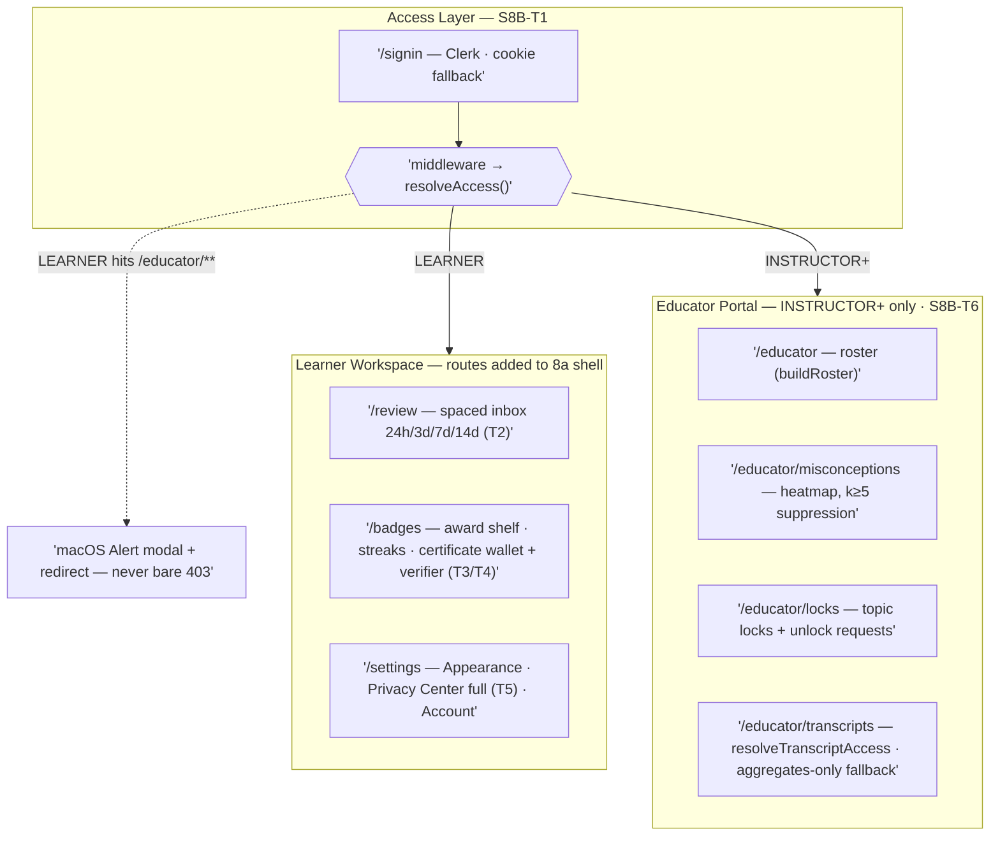

# Sprint 8b — Frontend Experience Iteration 2 (Trust, Portals & Polish)
**Phase 2 → 4 bridge · Part 2 of 2 (iteration 2)** | **Window:** 2026-12-29 → 2027-01-04 | **Owner:** FE Eng
**Epic ref:** Doc 07 · TASK 3.1 completion + PRD F8/F10/F11 UI | **Master plan:** [08_LearnOS-Sprint-Execution-Plan.md](../08_LearnOS-Sprint-Execution-Plan.md)
**Split:** Sprint 8 was split into [**Sprint 8a — MVP**](./Sprint-08a_Frontend-Experience-macOS-MVP.md) (shipped first) and **8b (this doc, iteration 2)**. The macOS design system spec is normative in 8a §4 and inherited here unchanged.

---

## 1. Sprint Goal

Layer trust, identity and portals onto the 8a MVP: real authentication with role gating, the full progress dashboard + review inbox, badges & streaks, the credential wallet with public verifier, the complete Privacy Center, and the INSTRUCTOR-gated educator portal — then close the responsive/polish gaps deliberately deferred from the MVP. Every backend capability listed in 8a §5.1 marked **S8B** gets a UI home this sprint.

## 2. Entry Criteria

- Sprint 8a exit review passed; all 8a DoD items green; MVP live on the public URL.
- Legacy demo already removed (8a T8); single Next deploy in place.
- Badge/certificate/progress/consent/aggregation engines available from Sprints 4–5 (`src/**` imports work today).

## 3. Scope & Tasks

| ID | Task | Subtasks / Notes | Refs |
| :--- | :--- | :--- | :--- |
| **S8B-T1** | Auth & role gating *(former S8-T9)* | Sign-in via Clerk (schema slot `users.clerk_id`) with flag-gated session-cookie fallback retained for demo tenants; middleware maps session → `Requester{role}` and enforces `resolveAccess`; `/educator/**` requires INSTRUCTOR+ — LEARNERS get a macOS Alert modal + redirect, never a bare 403; server components derive tenant/user from session, not client input. Demo-tenant session from 8a is retired once Clerk is live. | `src/access/precedence.ts`; Doc 05 |
| **S8B-T2** | Progress dashboard & review inbox *(former S8-T7 progress slice)* | Matrix card — gain gauge Δ%, per-concept mastery chips, due-in pills 24h/3d/7d/14d mirroring `REVIEW_OFFSET_HOURS` — fed by `buildProgressMatrix`; replaces the 8a session-summary card as session-complete destination; `/review` spaced inbox unmounts the sidebar placeholder; reviewer starter prompt reused verbatim. | PRD F8; `pedagogy/progress.ts`; `tools/spaced-rep.ts` |
| **S8B-T3** | Badges & streaks *(former S8-T7 slice)* | Award shelf + streak counter via `decideAwards`/`computeStreak`, revoked-state rendering; `/badges` route goes live (sidebar entry un-disables). | `credentialing/badges.ts` |
| **S8B-T4** | Credential wallet & public verifier *(former S8-T7 slice)* | Verification-code display/copy, certificate **SVG/PDF download** (`renderCertificateSvg`/`renderCertificatePdf`), code checker using `verifyVerificationCode`. | `credentialing/certificate.ts` |
| **S8B-T5** | Full Privacy Center *(completes former S8-T7)* | Settings Privacy tab: granular consent toggles beyond the 8a revoke gate, transcript-lock status, consent lifecycle audit view. Extends — never bypasses — the 8a consent gate contract. | `privacy/consent.ts`; `privacy/transcript-lock.ts` |
| **S8B-T6** | Educator portal (INSTRUCTOR-gated) *(former S8-T7 educator slice)* | Roster via `buildRoster`; misconception heatmap honouring `DEFAULT_K_ANONYMY_FLOOR=5` cell suppression (enforced server-side in aggregation builders, never client-side only); topic locks via `resolveLockedConcepts` with unlock-request affordance; raw-transcript requests through `resolveTranscriptAccess` — aggregates-only fallback UI on `TranscriptLockedError`. Routes: `/educator`, `/educator/misconceptions`, `/educator/locks`, `/educator/transcripts`. | PRD F11; `educator/aggregation.ts`; Doc 06 §9 |
| **S8B-T7** | Responsive & polish pass *(deferred from 8a)* | Mobile/tablet refinement of the ≤1024px collapse (drawer ergonomics, HUD bottom-sheet gestures); ⌘K palette coverage across all new routes; material/motion tuning from MVP feedback; re-run Lighthouse budgets with new routes mounted. | Doc 06 §12; 8a §4.4 |

Sizes: T1 M · T2 M · T3 S · T4 M · T5 S · T6 L · T7 M.

### 3.1 Information Architecture — additions to the 8a tree

Gating rules added: `/educator/**` unreachable for LEARNER (Alert + redirect per T1); `/badges`, `/review` mount only after their engines pass the specs in §4; sidebar placeholders from 8a are removed, not hidden.

## 4. Testing Gates

| Suite | Type | Pass Condition |
| :--- | :--- | :--- |
| `rbac.e2e.spec` | Playwright | LEARNER session hitting `/educator/**` receives Alert + redirect; INSTRUCTOR passes through |
| `review-inbox.spec` | vitest | Due-in pills mirror `REVIEW_OFFSET_HOURS` (24h/3d/7d/14d) exactly; overdue rendering |
| `matrix.spec` | vitest | Gain gauge Δ% and mastery chips match `buildProgressMatrix` output fixture-for-fixture |
| `badges.spec` | testing-library | Award shelf renders earned/locked/revoked states; streak counter matches `computeStreak` |
| `wallet.spec` | testing-library | SVG/PDF downloads trigger; verifier accepts valid code and rejects tampered/expired codes |
| `privacy-center.spec` | vitest | Toggle changes persist; transcript-lock status reflects `resolveTranscriptAccess`; consent gate contract unchanged from 8a |
| `educator.spec` | vitest + Playwright | Heatmap suppresses cells below k=5; unlock-request affordance fires; `TranscriptLockedError` → aggregates-only fallback UI |
| `a11y.audit` | axe-core CI | Zero critical violations on all new/changed routes, both modes |
| Coverage / Budgets | CI/Lighthouse | ≥85% on new `lib/`, `hooks/`, `components/`; first-load ≤200KB gz maintained with new routes |

## 5. Exit Criteria / DoD

- [ ] Role gate verified: LEARNER cannot reach `/educator/**` (Alert + redirect); sign-in via Clerk live with cookie fallback flag-off-capable
- [ ] Progress matrix mirrors `REVIEW_OFFSET_HOURS`; reviewer starter prompt reused verbatim; `/review` inbox serves due items enqueued since 8a
- [ ] Badge shelf + streak live incl. revoked-state rendering; certificate SVG/PDF downloadable and verifier accepts valid / rejects tampered codes
- [ ] Full Privacy Center shipped; 8a consent lifecycle behaviour regression-free
- [ ] Educator portal honours `DEFAULT_K_ANONYMY_FLOOR=5`; topic locks + unlock requests work; transcript requests degrade to aggregates-only on lock
- [ ] All gates in §4 green in CI; repo-wide `npm run test:coverage` green including web suites
- [ ] Responsive polish pass complete; Lighthouse perf+a11y ≥90 re-verified with all routes mounted

## 6. Risks & Watch Items

| Risk | Mitigation |
| :--- | :--- |
| Clerk vendor dependency slips | Cookie-session fallback stays shippable; RBAC gate (T1) and educator portal (T6) are testable without the vendor; Clerk becomes a fast-follow flag flip |
| Heatmap inference around suppressed cells | Suppression enforced server-side inside aggregation builders; client never receives raw sub-floor cells |
| Polish scope creep (T7) | Timebox T7 to structural breakpoints + palette/material tuning; mobile parity beyond Doc 06 §12 stays in post-v1 backlog |
| Two-week envelope compression | 8b starts only after the 8a exit review; if 8a slips, the 8b window shifts — do not interleave or pull trust scope forward |

## 7. Status Snapshot

**Updated: 2026-08-24 (implementation session).**

| Task | Status | Notes |
| :--- | :--- | :--- |
| S8B-T1 Auth & role gating | ✅ Shipped (cookie fallback) | Clerk keys absent in env ⇒ risk-table cookie fallback shipped: HMAC-signed `learnos_session` (Node impl + Web-Crypto edge twin), `/signin` demo role picker, middleware RBAC, LEARNER→`/today?denied=educator` Alert modal. Clerk mounts later behind the same `AppSession` shape. |
| S8B-T2 Matrix & review inbox | ✅ Shipped | `lib/progress-view.ts` (CAT prior heuristic documented) → `ProgressMatrixCard`; `/review` inbox mirrors `REVIEW_OFFSET_HOURS`, overdue bucket, verbatim reviewer starter prompt; SUMMARY phase books streak day + review ladder; replaces summary as destination via "Review inbox →" CTA. |
| S8B-T3 Badges & streaks | ✅ Shipped | `lib/badge-catalog.ts` (universal ×4 + slugified subject badge) over `decideAwards`/`foldAwards`/`computeStreak`; earned/locked/revoked states + revoke affordance on `/badges`. |
| S8B-T4 Wallet & verifier | ✅ Shipped | In-memory registry (`lib/server/certificates.ts`) + `/api/certificates` (issue idempotent, public verify) + `/api/certificates/render` (SVG/PDF download, Node runtime); verifier auto-corrects O/0·I/L per engine normalizer. Registry is process-local — persistence lands with the DB surfaces. |
| S8B-T5 Privacy Center | ✅ Shipped | `/privacy`: granular toggles persisted to the learner ledger, append-only audit trail, live self-access decision via `resolveTranscriptAccess`, JSON export, revoke preserves 8a contract. |
| S8B-T6 Educator portal | ✅ Shipped | Server components under role-gated layout; alias roster, heatmap with k≥5 suppression rendered server-side, topic locks + POST unlock requests (403 for non-instructors defense-in-depth), transcript raw/aggregates/DENY paths verified against minor/adult/unknown targets in prod smoke. |
| S8B-T7 Polish pass | ◐ Partial | Palette commands cover all new routes + sign-out + educator entry (role-gated); sidebar placeholders removed (`/privacy` added). Lighthouse re-run and drawer/HUD gesture tuning still open. |

Gates at snapshot: typecheck ✅ · eslint 0 errors ✅ (12 advisory warnings) · vitest web **55/55** ✅ incl. axe zero-critical on new surfaces ✅ · production build ✅ (all routes ≤141KB gz, middleware 34.7KB) · prod smoke ✅ (RBAC redirects 307s, 401/403 API gates, certificate issue→verify→render roundtrip, transcript raw/aggregates/DENY).

Open follow-ups: Clerk flag-flip when vendor keys land; certificate registry + ledger server-side persistence with DB; Playwright `rbac.e2e.spec` (browser install decision from 8a still pending); Lighthouse re-run; mobile drawer ergonomics.
